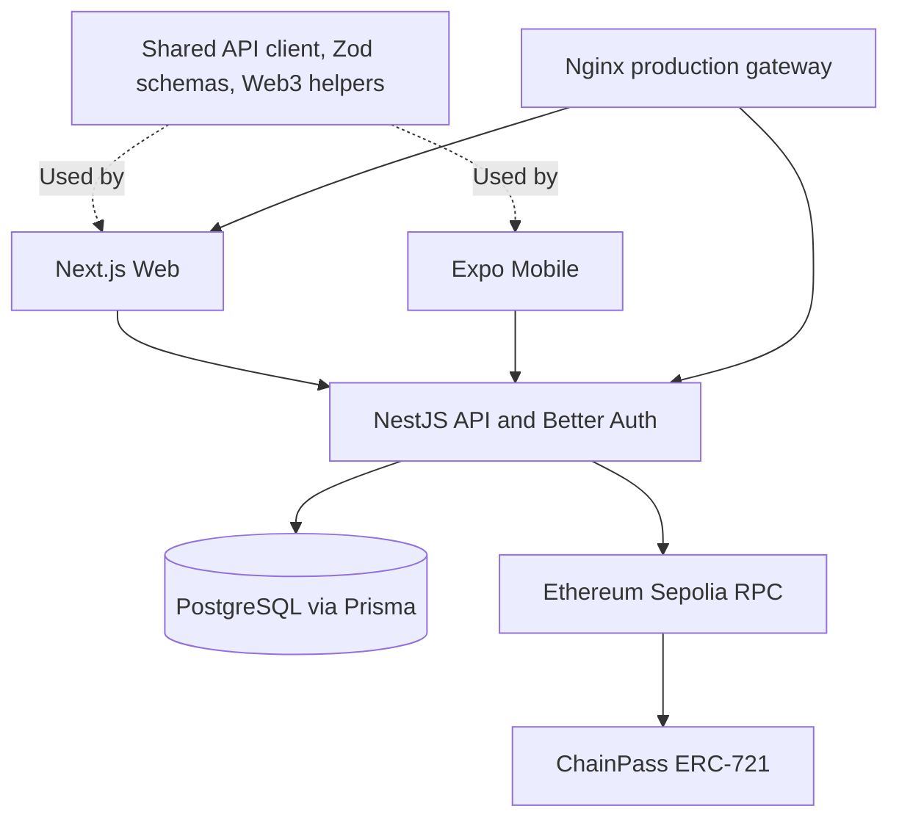

ChainPass

基于可验证钱包所有权与一次性入场机制的数字活动通行证系统。

ChainPass 将活动主办方、参与者和现场验票人员连接到同一套票务流程中：创建活动、发行票种、领取通行证、展示动态二维码并完成核销。参与者还可以选择将自己的通行证铸造为 Ethereum Sepolia 上不可转让的 ERC-721 NFT。

中文 | English

ChainPass 是什么？

一张门票截图无法告诉现场工作人员：它现在是否仍然有效、由谁签发，以及是否已经被使用。

ChainPass 为每位参与者提供一个持续存在的数字通行证，并将“验证通行证是否有效”和“真正允许持有人入场”拆分为两个独立步骤。

Merchant 可以创建并发布活动以及配置票种库存；User 可以浏览已发布活动、领取通行证，并展示一个短时有效的动态入场二维码；活动主办方负责验证通行证，并明确确认 Check-in。数据库保证同一张通行证无法被成功核销两次，包括并发请求的情况。

区块链在 ChainPass 中提供的是公开的身份与所有权记录，而不是替代传统票务后端。

经过验证的钱包可以收到一个与数据库 Pass ID 绑定的唯一 Token。活动内容、票种库存、用户账户、QR 凭证以及入场状态仍然存储在 PostgreSQL 中。

即使没有钱包、没有 Mint，甚至区块链 RPC 当前不可用，链下 Pass 依然可以正常使用。

⸻

核心流程

flowchart LR
    A[Merchant 创建活动] --> B[创建可用票种]
    B --> C[发布活动]
    C --> D[User 浏览并领取 Pass]
    D --> E[User 展示动态二维码]
    D -. 可选 .-> W[验证钱包所有权]
    W --> M[API Issuer 在 Sepolia 铸造 ERC-721]
    M --> E
    E --> V[Organizer 验证当前 Pass]
    V --> R[明确确认 Check-in]
    R --> S[数据库记录 CHECKED_IN]
    S --> U[User 查看更新后的状态]

Verify 是只读操作，Check-in 是独立的写操作。

智能合约不会记录 Check-in 或 Revocation 状态。

⸻

核心功能

* 活动发布： Organizer 创建并拥有 Draft 活动，配置 Active Ticket Type，发布活动供公开发现，并由服务端计算剩余库存。
* 数字通行证： 每个用户针对同一票种只能领取一次，库存采用原子分配；用户拥有个人 Pass 列表与 Pass 详情页面。
* 动态二维码： 服务端签发 60 秒有效凭证，客户端自动刷新，并支持过期反馈与篡改拒绝。
* 现场核销： 支持 QR 或手动 Pass ID 验证，展示持有人、活动及状态信息，并通过原子操作确保一次性 Check-in。
* 钱包与 Mint： 通过签名验证钱包所有权，由 API Issuer 支付 Sepolia Mint Gas，确认交易 Receipt，提供区块浏览器链接，并处理链上成功但数据库写入失败后的恢复。
* 角色工作区： 提供 Attendee、Merchant 活动/核销工作区，以及 Admin 用户升级 Merchant 和平台活动管理能力。
* Web 与 Mobile： 响应式 Web 产品与 Expo 原生应用共享同一套 API 与 Schema。真实原生设备验收与浏览器预览、Build Check 分开管理。
* 完整部署系统： Web / API / PostgreSQL Docker 化部署，通过 Nginx 对外提供服务，支持数据库迁移、CI Quality Gate 和人工触发的 Production Delivery。

目前没有支付和退款流程。

票价目前只是存储和展示的元数据，领取 Pass 不会产生实际付款。

当前也尚未实现：

* Event / Ticket 编辑与删除
* Pass 转让
* Revocation Endpoint

⸻

产品区域

区域	入口	演示内容
Public Web	/, /events, /events/[eventId]	浏览真实已发布活动及可领取票种
Attendee Web	/login, /register, /my-passes, /my-passes/[passId]	领取 Pass、动态 QR、钱包绑定、可选 Mint 和入场状态
Merchant Web	/merchant, /merchant/events, /merchant/events/new, /merchant/events/[eventId], /merchant/check-in	创建活动、发行票种、发布、验证和核销
Admin Web	/admin, /admin/users, /admin/events	查看用户/活动，并将普通 User 提升为 Merchant
Mobile	Expo User、Merchant、Admin 工作区	原生 Pass 展示、Wallet/Mint UI、Camera/Manual Check-in 和角色导航

注册始终只会创建普通 User。

Merchant 权限由 Admin 授予，不存在公开的 Admin 或 Merchant 注册入口。

仓库目前不包含产品截图；首页中的 Ticket Illustration 只是视觉预览，并不代表真实签发的 Pass。

⸻

架构概览

flowchart TB
    Web[Next.js Web] --> API[NestJS API + Better Auth]
    Mobile[Expo Mobile] --> API
    Shared[共享 API Client / Zod Schema / Web3 Helpers] -. Used by .-> Web
    Shared -. Used by .-> Mobile
    API --> DB[(PostgreSQL via Prisma)]
    API --> RPC[Ethereum Sepolia RPC]
    RPC --> Contract[ChainPass ERC-721]
    Gateway[Nginx Production Gateway] --> Web
    Gateway --> API

⸻

技术栈

以下版本来自应用 Manifest，实际依赖解析由 Lockfile 固定。

层级	实现
Web	Next.js 16.3.6、React 19.2.8、Tailwind CSS 4、Base UI shadcn、TanStack Query、React Hook Form/Zod、Motion、Sonner
API / Identity	NestJS 12、Better Auth 1.7、TypeScript ESM、Swagger/OpenAPI
Mobile	Expo SDK 57、React Native 0.86.3、Expo Router、NativeWind 4、Reanimated/Skia、SecureStore
Database	PostgreSQL 17、Prisma 7 + PostgreSQL Driver Adapter
Blockchain	Solidity ^0.8.28、Foundry、OpenZeppelin ERC-721/Ownable、viem；Web 使用 Reown/Wagmi，Mobile 使用 Reown/Ethers
Tooling	Node.js 24、pnpm 12.6.0、Turborepo 2
Delivery	GitHub Actions、Linux/amd64 Docker Image、Docker Compose、System + Container Nginx

⸻

仓库结构

apps/
  web/          Public 产品以及 User / Merchant / Admin Web 工作区
  api/          Business API、Better Auth、Prisma Schema 与 Migration
  mobile/       Expo App，包含基于角色的原生工作区
  telegram-mini/ Experimental Telegram Mini App
  telegram-bot/  Experimental Telegram Bot
  extension/     Experimental Browser Extension
  discord-bot/   Experimental Discord Bot
  wechat-mini/   Experimental WeChat Mini Program
packages/
  api-client/   与框架无关的 Business HTTP Client
  schemas/      共享 Zod Request / Response Boundary
  web3/         Contract ABI、Sepolia、Pass Hash 与 Explorer Helpers
  config/       共享 TypeScript 配置
contracts/      ChainPass Solidity Contract、Foundry Test 与部署记录
infra/          Development DB、Production Image / Compose、Nginx 与 Deploy Helper
.github/        CI 与手动触发的 Production Deploy Workflow
docs/           Engineering Contract、Submission Document 与 Operations

⸻

应用

Workspace	用途	成熟度
apps/web	Next.js Web 产品	Core / Production
apps/api	NestJS Backend API	Core / Production
apps/mobile	Expo iOS / Android 应用	Core Client；Native Acceptance 单独跟踪
@chainpass/telegram-mini	Telegram Mini App	Experimental Welcome Page Scaffold
@chainpass/telegram-bot	Telegram Bot	Experimental /start Command
@chainpass/extension	WXT Browser Extension	Experimental Popup Scaffold
@chainpass/discord-bot	Discord Bot	Experimental /hello Command
@chainpass/wechat-mini	Taro 微信小程序	Experimental Welcome Page Scaffold

这五个平台目前都是实验性 Workspace，而不是 Production Docker Service，也不是完整的 ChainPass Business Client。

默认 Root Check 仍然只覆盖现有 Web / API / Mobile / Shared Package 范围。

需要检查实验平台时，显式运行：

pnpm check:platforms

检查所有 Workspace：

pnpm check:all

详细命令和框架兼容边界参见：

Experimental Platforms

⸻

快速开始

环境要求与安装

需要：

* Node.js 24
* pnpm 12.6.0
* Docker + Compose

只有进行 Contract Test 或运行 Local Chain 时才需要 Foundry；普通的链下活动浏览和 Check-in 不依赖 Foundry。

完整 Native Test 还需要兼容的真机或 Simulator，以及 Expo Development Build，才能完成完整 Wallet Acceptance。

git clone https://github.com/Maimai10808/chainpass.git
cd chainpass
pnpm install --frozen-lockfile
cp apps/api/.env.example apps/api/.env
cp apps/web/.env.example apps/web/.env.local
cp apps/mobile/.env.example apps/mobile/.env

在被 Git 忽略的 API 环境文件中，为：

BETTER_AUTH_SECRET
QR_VERIFICATION_SECRET

分别设置独立的随机 Secret。

启动之前请检查各环境变量模板，Placeholder 不能作为真正的 Secret 使用。

本地 Web / API Origin 必须保持一致。

如果使用物理手机测试 Mobile，EXPO_PUBLIC_API_URL 必须设置为手机能够访问到的 API 地址，而不能使用手机自己的 localhost。

⸻

数据库与应用

Development Compose 将 PostgreSQL 发布到 Host Port 55432。

Production 环境不会将数据库端口公开到 Host。

docker compose -f infra/docker-compose.yml up -d postgres
pnpm --filter api exec prisma validate --config prisma7.config.ts
pnpm --filter api exec prisma migrate deploy --config prisma7.config.ts
pnpm --filter api exec prisma generate

分别在独立 Terminal 中启动：

pnpm --filter api dev       # http://localhost:3001
pnpm --filter web dev       # http://localhost:3000
pnpm --filter mobile dev    # Expo / Metro

API Health：

http://localhost:3001/health

Swagger：

/docs

OpenAPI JSON：

/docs/openapi.json

Production Gateway 会为 Business Path 添加 /api 前缀。

如果需要在全新本地环境中进行 Role Demo，请按照：

Web setup

中的明确 Local-only Account Bootstrap 流程操作。

Demo Password 不会存储在受版本控制的文档中。

不要对 Production 运行 Local Bootstrap 或 Test Fixture。

⸻

可选：区块链开发

当前 Sepolia Contract 部署信息记录在：

sepolia.json

Mint 需要：

* 可访问的 RPC
* 经过授权的 Issuer Signer

Issuer Signer 只能存在于 API Runtime 中。

Clone 仓库后不会获得这个 Signer。

因此，不要为了运行链下 Demo 而新建替代 Wallet 或重新部署 Contract。

cd contracts
forge build
forge test

Local Anvil Deployment 和 Opt-in Integration 说明参见：

* Contracts
* Technical Details

如果修改 Contract，还必须主动同步 ABI：

pnpm web3:sync-abi

⸻

环境变量

始终使用仓库中跟踪的 .env.example 模板。

绝对不要将 Production Credential 写入源码或 Build Argument。

Template	重要变量及用途
apps/api/.env.example	DATABASE_URL；Better Auth URL/Secret 和 WEB_ORIGIN；QR_VERIFICATION_SECRET；CHAIN_ID、RPC、Contract Address 和仅服务端使用的 Issuer Key
apps/web/.env.example	NEXT_PUBLIC_API_URL、NEXT_PUBLIC_AUTH_URL、NEXT_PUBLIC_APP_URL；公开 Chain / Contract / Reown 配置
apps/mobile/.env.example	可访问的 EXPO_PUBLIC_API_URL；公开 App、Chain、Contract 和 Reown 配置
contracts/.env.example	SEPOLIA_RPC_URL、公开 DEPLOYER_ADDRESS 和 Contract Address；部署使用 CLI Signer
infra/.env.production.example	Public Origin、Image Tag、Listener Binding、Database Settings 和 API Runtime Secrets

NEXT_PUBLIC_* 会在 Web Build 时写入客户端。

EXPO_PUBLIC_* 属于公开客户端配置。

因此两者都不能包含：

* Private Key
* Signing Secret
* Database Credential
* Authenticated RPC URL

API Template 中遗留的 JWT_SECRET 当前并未被 Session Authentication Implementation 使用。

⸻

Demo 流程

1. 以 Merchant 身份登录，创建一个具有合法开始/结束时间范围的活动。
2. 添加 Active Ticket Type 和 Inventory；无支付 Demo 可以将 Price 设置为 0。
3. Publish 活动。活动随后会出现在 Public Discovery 中，包括匿名访问者也可以查看。
4. 以普通 User 身份登录，打开活动并 Claim Pass，然后从 My Passes 进入详情。
5. 可选：连接 Sepolia Wallet，签署 Server Challenge，完成 Wallet Binding 并 Mint。在 Explorer 中查看真实 Token 与 Transaction。
6. 向对应活动的 Merchant 展示 Rotating QR。Merchant 先 Verify，检查 Holder / Event / State，然后确认 Check-in。
7. 再次 Verify 同一 Pass，将得到 ALREADY_CHECKED_IN。第二次 Check-in 会被拒绝；User Pass Detail 刷新为 CHECKED_IN，并且不再展示可用 QR。

如果 Camera 不可用，Merchant 可以手动输入 Pass ID。

浏览器 Camera Scanning 需要 Secure Context。当前公开的 HTTP Teaching Deployment 不支持 HTTPS Camera Acceptance。

⸻

Production 与技术深入

* Architecture & Deployment：当前 Production Snapshot、CI Gate、Image Delivery、Migration、Health Check、Recovery 和 Rollback。
* Technical Details：Domain Model、Authorization、QR Protocol、Contract Design 和 Consistency。
* Operations：Host-specific Operational Command；较旧的 Audit Snapshot 需要与当前 Deployment Document 对照确认。
* Web / Mobile：Platform Setup 和已记录的 Acceptance Boundary。

系统当前运行在共享的 Huawei Cloud Teaching Host 上。

当前 Live Release 和 Verified Health 的日期记录在 Architecture & Deployment 文档中。

这是一个运行于 Ethereum Sepolia 的 HTTP Hackathon Demo，而不是 Mainnet Payment Service。

⸻

Roadmap

目前尚未交付：

* Domain / HTTPS
* 完整 Native Device Acceptance
* 经过测试的 Off-host Backup / Restore
* 更快的 Image Distribution
* Issuer Key Custody / Rotation
* Event / Ticket Editing
* Revocation Workflow
* Pass Transfer
* Payment
* Refund

这些功能需要单独的产品和工程工作，不能从当前 UI 或 Schema 推断为已经支持。

⸻

License

目前仓库的 License 尚未统一：

* Root Manifest 声明为 ISC
* API Manifest 标记为 UNLICENSED
* Solidity Source 使用 MIT SPDX Identifier
* Mobile Starter 保留 Expo MIT Notice
* 当前不存在顶层 LICENSE 文件

因此，现有文档不构成新的 Repository-wide License Grant。

⸻

English Version


# ChainPass

**Digital event passes with verifiable wallet ownership and one-time entry.**

ChainPass connects event organizers, attendees, and door staff in one ticketing workflow: create an event, issue ticket types, claim a pass, present a rotating QR, and confirm check-in. An attendee can optionally mint their pass as a non-transferable ERC-721 on Ethereum Sepolia.

## What is ChainPass?

A ticket screenshot does not tell door staff whether it is current, who issued it, or whether it has already been used. ChainPass gives each attendee a persistent digital pass and separates checking its validity from actually admitting its holder.

Merchants create and publish events with ticket inventory. Users discover published events, claim passes, and show a short-lived entry QR. The event organizer verifies the pass and explicitly confirms check-in; the database prevents a second successful admission, including concurrent requests.

Blockchain adds a public identity and ownership record, not a replacement for the ticketing backend. A verified wallet can receive a unique token linked to a database Pass ID. Event content, inventory, attendee accounts, QR credentials, and admission status remain in PostgreSQL. **An off-chain pass is usable without a wallet, a mint, or a working blockchain RPC.**

## Core Flow

```mermaid
flowchart LR
    A[Merchant creates event] --> B[Creates active ticket type]
    B --> C[Publishes event]
    C --> D[User discovers and claims pass]
    D --> E[User presents rotating QR]
    D -. Optional .-> W[Prove wallet ownership]
    W --> M[API issuer mints ERC-721 on Sepolia]
    M --> E
    E --> V[Organizer verifies current pass]
    V --> R[Explicit check-in]
    R --> S[DB records CHECKED_IN]
    S --> U[User sees updated state]
```



Verify is read-only. Check-in is a separate write. The smart contract does **not** record check-in or revocation.

## Key Features

- **Event publishing:** organizer-owned drafts, active ticket types, public published-event discovery, and server-calculated remaining inventory.
- **Digital passes:** one claim per user and ticket type, atomic inventory allocation, personal pass list, and ticket detail.
- **Dynamic QR:** server-signed 60-second credentials, automatic refresh, expiry feedback, and tamper rejection.
- **Gate operations:** QR or manual Pass ID verification, holder/event details, explicit confirmation, and atomic one-time check-in.
- **Wallet and mint:** signature-verified wallet binding, issuer-paid Sepolia mint, receipt confirmation, explorer links, and recovery after a chain/DB write gap.
- **Role workspaces:** attendee, Merchant event/check-in workspace, and Admin user-to-Merchant promotion and platform event views.
- **Web and Mobile:** responsive Web product and Expo role-based screens sharing the same API and schemas. Native device acceptance remains distinct from browser preview and build checks.
- **Deployed system:** Dockerized Web/API/PostgreSQL behind Nginx, migrations, CI quality gates, and manually triggered production delivery.

There is no payment or refund flow. Ticket prices are stored/displayed metadata; claiming does not charge a payment. Event/ticket editing and deletion, pass transfer, and a revocation endpoint are not currently implemented.

## Product Areas

| Area | Entry points | What to demonstrate |
| --- | --- | --- |
| Public Web | `/`, `/events`, `/events/[eventId]` | Discover real published events and available ticket types |
| Attendee Web | `/login`, `/register`, `/my-passes`, `/my-passes/[passId]` | Claim, rotating QR, wallet binding, optional mint, and admission state |
| Merchant Web | `/merchant`, `/merchant/events`, `/merchant/events/new`, `/merchant/events/[eventId]`, `/merchant/check-in` | Create, issue, publish, verify, and admit |
| Admin Web | `/admin`, `/admin/users`, `/admin/events` | Inspect users/events and promote a user to Merchant |
| Mobile | Expo User, Merchant, and Admin workspaces | Native pass display, wallet/mint UI, camera/manual check-in, and role-specific navigation |

Registration always creates a normal user. Merchant access is granted by an Admin; there is no public Admin/Merchant signup option. The repository does not include product screenshots; the homepage ticket illustration is explicitly a visual preview, not an issued pass.

## Architecture Overview



## Tech Stack

Versions below reflect the application manifests; the lockfile fixes the dependency resolution.

| Layer | Implementation |
| --- | --- |
| Web | Next.js 16.3.6, React 19.2.8, Tailwind CSS 4, Base UI shadcn, TanStack Query, React Hook Form/Zod, Motion, Sonner |
| API / identity | NestJS 12, Better Auth 1.7, TypeScript ESM, Swagger/OpenAPI |
| Mobile | Expo SDK 57, React Native 0.86.3, Expo Router, NativeWind 4, Reanimated/Skia, SecureStore |
| Database | PostgreSQL 17, Prisma 7 with the PostgreSQL driver adapter |
| Blockchain | Solidity `^0.8.28`, Foundry, OpenZeppelin ERC-721/Ownable, viem; Reown/Wagmi on Web and Reown/Ethers on Mobile |
| Tooling | Node.js 24, pnpm 12.6.0, Turborepo 2 |
| Delivery | GitHub Actions, Linux/amd64 Docker images, Docker Compose, system and container Nginx |

## Repository Structure

```text
apps/
  web/          Public product and User / Merchant / Admin Web workspaces
  api/          Business API, Better Auth, Prisma schema and migrations
  mobile/       Expo app with role-based native workspaces
  telegram-mini/ Experimental Telegram Mini App
  telegram-bot/  Experimental Telegram Bot
  extension/     Experimental browser extension
  discord-bot/   Experimental Discord Bot
  wechat-mini/   Experimental WeChat Mini Program
packages/
  api-client/   Framework-independent business HTTP client
  schemas/      Shared Zod request/response boundaries
  web3/         Contract ABI, Sepolia, pass hashing and explorer helpers
  config/       Shared TypeScript configuration
contracts/      ChainPass Solidity contract, Foundry tests and deployment record
infra/          Development DB, production images/Compose, Nginx and deploy helper
.github/        CI and manually triggered Production Deploy workflows
docs/           Engineering contracts, submission documents and operations
```

## Applications

| Workspace | Purpose | Maturity |
| --- | --- | --- |
| `apps/web` | Next.js Web product | Core / production |
| `apps/api` | NestJS backend API | Core / production |
| `apps/mobile` | Expo iOS / Android application | Core client; native acceptance tracked separately |
| `@chainpass/telegram-mini` | Telegram Mini App | Experimental welcome-page scaffold |
| `@chainpass/telegram-bot` | Telegram Bot | Experimental `/start` command |
| `@chainpass/extension` | WXT browser extension | Experimental popup scaffold |
| `@chainpass/discord-bot` | Discord Bot | Experimental `/hello` command |
| `@chainpass/wechat-mini` | Taro WeChat Mini Program | Experimental welcome-page scaffold |

The five experimental platforms are workspace members, not production Docker
services or full ChainPass business clients. Default root checks retain the
existing Web/API/Mobile/shared-package scope. Run `pnpm check:platforms` explicitly
for their lint, typecheck, and build checks, or `pnpm check:all` for all workspaces.
See [Experimental Platforms](docs/EXPERIMENTAL_PLATFORMS.md) for commands and
framework compatibility boundaries.

## Getting Started

### Requirements and installation

Use Node.js 24, pnpm 12.6.0, and Docker with Compose. Foundry is needed for contract tests or a local chain, not for ordinary off-chain browsing and check-in. Native testing additionally needs a compatible device or simulator and an Expo development build for full wallet acceptance.

```bash
git clone https://github.com/Maimai10808/chainpass.git
cd chainpass
pnpm install --frozen-lockfile
cp apps/api/.env.example apps/api/.env
cp apps/web/.env.example apps/web/.env.local
cp apps/mobile/.env.example apps/mobile/.env
```

Set independent random `BETTER_AUTH_SECRET` and `QR_VERIFICATION_SECRET` in the ignored API file. Review the templates before starting; placeholders are not usable secrets. Keep local Web/API origins aligned. On a physical device, set `EXPO_PUBLIC_API_URL` to an API address the device can reach, not the device's `localhost`.

### Database and applications

The development Compose publishes PostgreSQL at host port **55432**. Production does not publish the database.

```bash
docker compose -f infra/docker-compose.yml up -d postgres
pnpm --filter api exec prisma validate --config prisma7.config.ts
pnpm --filter api exec prisma migrate deploy --config prisma7.config.ts
pnpm --filter api exec prisma generate
```

Run each app in its own terminal:

```bash
pnpm --filter api dev       # http://localhost:3001
pnpm --filter web dev       # http://localhost:3000
pnpm --filter mobile dev    # Expo / Metro
```

API health is `http://localhost:3001/health`; Swagger is `/docs` and OpenAPI JSON is `/docs/openapi.json`. The production gateway adds `/api` to business paths.

For a fresh local role demo, follow the explicitly local-only account bootstrap in [Web setup](apps/web/README.md#reusable-local-demo-accounts). Demo passwords are not stored in tracked documentation. Do not run local bootstrap or test fixtures against production.

### Optional blockchain development

The existing Sepolia contract is recorded in [sepolia.json](contracts/deployments/sepolia.json). Mint requires a reachable RPC and the authorized issuer signer in **API runtime only**. A cloned repository does not include that signer. Do not create a replacement wallet or redeploy just to run the off-chain demo.

```bash
cd contracts
forge build
forge test
```

Local Anvil deployment and opt-in integration instructions are described in [Contracts](contracts/README.md) and [Technical Details](docs/TECHNICAL_DETAILS.md#17-testing). A contract change also requires deliberate ABI synchronization with `pnpm web3:sync-abi`.

## Environment Variables

Use the tracked examples, never copy production credentials into source or build arguments.

| Template | Important keys and purpose |
| --- | --- |
| `apps/api/.env.example` | `DATABASE_URL`; Better Auth URL/secret and `WEB_ORIGIN`; `QR_VERIFICATION_SECRET`; `CHAIN_ID`, RPC, contract address, and server-only issuer key |
| `apps/web/.env.example` | `NEXT_PUBLIC_API_URL`, `NEXT_PUBLIC_AUTH_URL`, `NEXT_PUBLIC_APP_URL`; public chain/contract/Reown configuration |
| `apps/mobile/.env.example` | Reachable `EXPO_PUBLIC_API_URL`; public app, chain, contract and Reown configuration |
| `contracts/.env.example` | `SEPOLIA_RPC_URL`, public `DEPLOYER_ADDRESS`, and contract address; deployment uses a CLI signer |
| `infra/.env.production.example` | Public origin, image tag, listener binding, database settings, and API runtime secrets |

`NEXT_PUBLIC_*` values are baked into the Web build. `EXPO_PUBLIC_*` values are public client configuration. Neither may contain a private key, signing secret, database credential, or authenticated RPC URL. The API template's legacy `JWT_SECRET` is not used by the current session authentication implementation.

## Demo

1. Sign in as a Merchant; create an event with a valid start/end range.
2. Add an active ticket type with inventory; use price zero for a payment-free demo.
3. Publish. The event appears in public discovery for all attendees, including anonymous visitors.
4. Sign in as a User, open the event, and claim a pass. Open its detail from My Passes.
5. Optionally connect a Sepolia wallet, sign the server challenge, bind it, and mint. Inspect the real token and transaction on the explorer.
6. Present the rotating QR to that event's Merchant. Verify, inspect the holder/event/state, then confirm check-in.
7. Verify the same pass again: `ALREADY_CHECKED_IN`. A second check-in is rejected; the User detail refreshes to `CHECKED_IN` and no longer shows a usable QR.

The Merchant can use a manual Pass ID if camera access is unavailable. Browser scanning requires a secure context; the current public HTTP teaching deployment does not provide HTTPS camera acceptance.

## Production and Technical Deep Dive

- [Architecture & Deployment](docs/ARCHITECTURE_AND_DEPLOYMENT.md): current production snapshot, CI gates, image delivery, migrations, health checks, recovery and rollback.
- [Technical Details](docs/TECHNICAL_DETAILS.md): domain model, authorization, QR protocol, contract design and consistency.
- [Operations](docs/OPERATIONS.md): host-specific operational commands; older audit snapshots must be checked against the current deployment document.
- [Web](apps/web/README.md) / [Mobile](apps/mobile/README.md): platform setup and recorded acceptance boundaries.

The system runs on a shared Huawei Cloud teaching host. The current live release and verified health are dated in Architecture & Deployment; this is an HTTP hackathon demo on Ethereum Sepolia, not a mainnet payment service.

## Roadmap

Not currently delivered: domain/HTTPS, full native device acceptance, tested off-host backup/restore, faster image distribution, and issuer-key custody/rotation. Event/ticket editing, a revocation workflow, transfers, payments and refunds would require separate product work; they are not implied by the current UI or schema.

## License

Licensing is not yet consolidated: the root manifest declares ISC, the API manifest says `UNLICENSED`, Solidity sources use MIT SPDX identifiers, and the Mobile starter retains [Expo's MIT notice](apps/mobile/LICENSE). No top-level `LICENSE` file is present. These documents do not establish a new repository-wide license grant.
