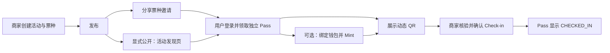
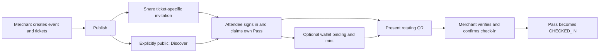

# ChainPass

[中文](#zh) · [English](#en)

<a id="zh"></a>

## 中文

**从邀请到入场，让每张数字票都有可核对的归属与状态。**

ChainPass 是面向活动组织者和参与者的数字票务系统。商家创建活动、发行票种并分享邀请；用户领取自己的 Pass，通过 Web 或 Mobile 展示动态二维码；商家核验后完成一次性核销，用户端同步显示最新状态。

数据库负责活动、库存和入场状态，区块链提供**可选的门票身份与钱包归属证明**。用户不必先有钱包，也能领取和使用门票；签名绑定钱包后，可以把 Pass 铸造为 Ethereum Sepolia 上不可转让的 ERC-721。

### 产品如何使用



- **用户（C 端）**：注册、登录、浏览公开活动、打开邀请、领取门票、查看 My Passes、绑定钱包、Mint 和展示 QR。
- **商家（B 端）**：管理自己的活动、创建票种、发布、创建/分享/撤销邀请，以及扫码或手工核验和核销。
- **管理员（A 端）**：查看用户与平台活动，通过 Better Auth 将用户提升为 Merchant。注册页不能选择商家或管理员身份。
- **Web 与 Mobile**：消费同一 API 和数据边界，各自使用适合平台的界面，不是两套票务业务。

### 公开活动与邀请制

新活动默认 **INVITE_ONLY**，商家也可以显式选择 **PUBLIC**。邀请制活动发布后仍不进入公共发现页，知道 Event ID 也不能查看公开详情。

邀请绑定一个指定票种，可转发，并受领取次数、有效期和撤销状态限制。持有效链接的人可以预览，登录后领取自己的 Pass。不同商家的邀请不会混用活动或票种；多个邀请若指向同一票种，则共享该票种库存。**邀请不是门票，现场 QR 也不是邀请。** 撤销邀请只阻止后续领取，不撤销已领取门票。

### 区块链在这里做什么

当前使用 **Ethereum Sepolia 测试网，chain ID 11155111**。API 的 issuer 为已验证钱包 Mint；合约保存 `passHash → tokenId` 和 Token owner，防重复 Mint，并禁止转让。

活动内容、用户资料、库存、邀请、QR 和核销记录**不上链**。是否可入场仍由 API/数据库判断；区块链不是另一套登录或核销系统。公开证据见 [部署记录](contracts/deployments/sepolia.json)。

### 当前完成程度

| 模块   | 能力                                                                             |
| ------ | -------------------------------------------------------------------------------- |
| Web    | 三角色工作区、活动/邀请、Pass、钱包/Mint、动态 QR、Merchant 核销、Admin 用户管理 |
| Mobile | Expo 三角色工作区、邀请预览/领取/分享、Pass、钱包/Mint、动态 QR 与核验页面       |
| API    | Session/RBAC、归属校验、原子库存/邀请额度、一次性核销、Mint 恢复                 |
| 合约   | issuer-only、不可转让 ERC-721；Sepolia 部署与真实 Mint 记录                      |
| 部署   | Docker Compose、Nginx、PostgreSQL、CI 门禁、人工触发 Production Deploy           |
| 实验端 | Telegram Mini/Bot、Discord Bot、浏览器扩展、微信小程序：仅骨架，未接完整票务业务 |

实现、测试与上线是不同证据。Mobile 浏览器预览/Hermes 导出不等于真机相机、钱包跳转、分享、重启恢复与深链验收；生产历史健康记录也不表示当前分支已上线。

### 演示路径

1. Merchant 创建邀请制活动，添加 ACTIVE 票种并发布。
2. 为指定票种创建限次数、有有效期的邀请，分享链接。
3. User 打开邀请并登录/注册，领取独立 Pass。
4. 可选：签名绑定钱包，经应用 API Mint，查看 Token 与交易链接。
5. User 展示 QR；Merchant 扫码或输入 Pass ID，核验后明确确认 Check-in。
6. User 刷新/回到前台，看到 CHECKED_IN；同一门票不能再次核销。

摄像头需要兼容设备与安全上下文；HTTP 部署保留手工核验回退。账号密码不在文档或 Git 中公开。

### 文档导航

| 想了解什么                 | 阅读文档                                                                                                                          |
| -------------------------- | --------------------------------------------------------------------------------------------------------------------------------- |
| 产品定位与功能边界         | [产品说明](PRODUCT_BRIEF.md#zh)                                                                                                   |
| 模型、邀请、QR、链上一致性 | [技术细节](docs/TECHNICAL_DETAILS.md#zh)                                                                                          |
| Monorepo 与依赖规则        | [工程架构](docs/ARCHITECTURE.md#zh)                                                                                               |
| Session、角色与钱包身份    | [认证与授权](docs/AUTH_ARCHITECTURE.md#zh)                                                                                        |
| 路由、数据与错误规则       | [API 契约](docs/API_CONTRACT.md#zh)                                                                                               |
| 已完成范围与验收限制       | [开发范围](docs/DEVELOPMENT_SCOPE.md#zh)                                                                                          |
| 从源码到生产               | [架构与部署](docs/ARCHITECTURE_AND_DEPLOYMENT.md#zh)                                                                              |
| 镜像与紧急交付             | [部署指南](docs/DEPLOYMENT.md#zh)                                                                                                 |
| 发布、排障、备份、回滚     | [生产运维](docs/OPERATIONS.md#zh)                                                                                                 |
| 各端开发                   | [Web](apps/web/README.md#zh) · [API](apps/api/README.md#zh) · [Mobile](apps/mobile/README.md#zh) · [合约](contracts/README.md#zh) |
| 实验平台边界               | [实验平台](docs/EXPERIMENTAL_PLATFORMS.md#zh)                                                                                     |
| 视觉开发约束               | [Web Foundation](apps/web/lib/design/README.md#zh) · [Mobile Design](apps/mobile/src/design/README.md#zh)                         |

README 负责介绍；命令、权限与运维细节以专题文档为准。

### 本地快速开始

需要 Node.js 24、pnpm 12.6.0 和 Docker Compose。从仓库根目录执行；以下复制命令仅用于首次配置，已有本地环境文件不要覆盖：

```bash
pnpm install --frozen-lockfile
cp apps/api/.env.example apps/api/.env
cp apps/web/.env.example apps/web/.env.local
cp apps/mobile/.env.example apps/mobile/.env
docker compose -f infra/docker-compose.yml up -d postgres
```

在 ignored API env 中分别设置 `BETTER_AUTH_SECRET` 和 `QR_VERIFICATION_SECRET`，然后：

```bash
pnpm --filter api exec prisma validate
pnpm --filter api exec prisma migrate deploy
pnpm --filter api exec prisma generate
```

分别在终端启动：

```bash
pnpm --filter api dev
pnpm --filter web dev
pnpm --filter mobile dev
```

Web 默认 `http://localhost:3000`，API 默认 `http://localhost:3001`。真机 Mobile 必须使用设备可达的 API 地址。领取/核销不依赖钱包；Mint 另需安全配置服务器 RPC、合约与 issuer signer。完整说明见各端开发文档。

### 技术栈与目录

Next.js 16 / React 19；NestJS 12 / Better Auth 1.7；Expo SDK 57 / React Native 0.86；PostgreSQL 17 / Prisma 7；Solidity 0.8.28 / Foundry；pnpm / Turborepo。共享包共享 API、Schema、Web3 和工程配置，不强制共享 Web/Native UI。

```text
apps/       Web、API、Mobile 与五个实验端
packages/   api-client、schemas、web3、config
contracts/  合约、Foundry 测试与公开部署记录
infra/      Docker、Nginx、部署脚本与环境模板
docs/       产品、技术与运维文档
```

### 后续与许可

尚未实现支付/退款、票转让、二级市场、活动编辑/删除 API、生产 HTTPS、完整真机验收与应用商店发布。长期运行还需限流、备份恢复演练与 issuer key 管理。

仓库没有统一的顶层 LICENSE：根 package 声明 ISC，API 声明 UNLICENSED，合约源码为 MIT，部分模板保留原许可。复用前应确认模块许可，不将整个仓库笼统标成 MIT。

---

<a id="en"></a>

## English

**From invitation to admission, every digital pass has a verifiable owner and state.**

ChainPass connects event organizers and attendees. Merchants create events and ticket types, then share invitations. Attendees claim their own Pass, present rotating QR through Web or Mobile, and see the updated state after a merchant confirms one-time check-in.

The database owns events, inventory and admission. Blockchain provides **optional ticket identity and wallet ownership evidence**. No wallet is required to claim/use a pass; signature-based wallet binding enables minting a non-transferable ERC-721 on Ethereum Sepolia.

### Core flow



- **User**: sign in/register, discover public events, open invitations, claim/view passes, bind a wallet, mint and display QR.
- **Merchant**: manage own events, issue/publish tickets, create/share/revoke invitations and confirm QR/manual check-in.
- **Admin**: inspect users/events and promote users through Better Auth. Registration cannot select a privileged role.
- **Web/Mobile**: shared contracts, platform-specific UI, one backend business model.

### Public versus invitation-only

New events default to **INVITE_ONLY**; organizers may explicitly choose **PUBLIC**. Published private events remain hidden from public discovery/detail even when their ID is known.

Forwardable invitations select one ticket and enforce quota, expiry and revocation. Holders preview anonymously and claim after login. Event/ticket boundaries cannot be mixed. Invitations for the same ticket share inventory; attendees receive independent Passes. **An invitation is neither a ticket nor an entry QR.** Revocation blocks future claims, not existing passes.

### Blockchain's role

**Ethereum Sepolia testnet, chain ID 11155111.** The API issuer mints to a verified wallet. The contract stores `passHash → tokenId` and ownership, prevents duplicate minting and disables transfers.

Event content, personal data, stock, invitations, QR and check-ins are **not on-chain**. Admission remains an API/database decision, not wallet login or decentralized redemption. See the [public deployment record](contracts/deployments/sepolia.json).

### Implemented scope

| Area                 | Capability                                                                                      |
| -------------------- | ----------------------------------------------------------------------------------------------- |
| Web                  | Role workspaces, events/invitations, passes, wallet/mint, QR, merchant check-in and admin users |
| Mobile               | Expo role workspaces, invitation preview/claim/share, passes, wallet/mint, QR and gate screens  |
| API                  | Session/RBAC, ownership, atomic stock/quota, one-time admission and mint recovery               |
| Contract             | Issuer-only non-transferable ERC-721; Sepolia deployment and real mint records                  |
| Infrastructure       | Compose, Nginx, PostgreSQL, CI gates and manually dispatched Production Deploy                  |
| Experimental clients | Telegram Mini/Bot, Discord Bot, extension and WeChat: scaffolds, not full ticketing clients     |

Implementation, acceptance and deployment are separate. Expo Web/Hermes exports do not prove physical camera, wallet handoff, sharing, restart persistence or deep links. Historical production health does not prove this branch is deployed.

### Demo

1. Create an invitation-only event, add an ACTIVE ticket and publish.
2. Create/share a ticket-specific invitation with quota and expiry.
3. Open it as an attendee, sign in/register and claim an independent Pass.
4. Optionally bind a wallet by signature and mint through the application API.
5. Present QR; a merchant verifies and explicitly confirms check-in.
6. Refresh/foreground: CHECKED_IN appears and another admission is rejected.

Camera scanning needs supported hardware and a secure context; HTTP keeps manual fallback. Passwords are not distributed in docs/Git.

### Documentation directory

| Topic                                   | Document                                                                                                                               |
| --------------------------------------- | -------------------------------------------------------------------------------------------------------------------------------------- |
| Product and scope                       | [Product Brief](PRODUCT_BRIEF.md#en)                                                                                                   |
| Domain, invitations, QR and consistency | [Technical Details](docs/TECHNICAL_DETAILS.md#en)                                                                                      |
| Module/dependency rules                 | [Engineering Architecture](docs/ARCHITECTURE.md#en)                                                                                    |
| Sessions, roles and wallets             | [Auth Architecture](docs/AUTH_ARCHITECTURE.md#en)                                                                                      |
| Endpoints and contracts                 | [API Contract](docs/API_CONTRACT.md#en)                                                                                                |
| Delivery/acceptance limits              | [Development Scope](docs/DEVELOPMENT_SCOPE.md#en)                                                                                      |
| Source to production                    | [Architecture & Deployment](docs/ARCHITECTURE_AND_DEPLOYMENT.md#en)                                                                    |
| Images and emergency delivery           | [Deployment Guide](docs/DEPLOYMENT.md#en)                                                                                              |
| Release, diagnosis, backup, rollback    | [Operations](docs/OPERATIONS.md#en)                                                                                                    |
| Application guides                      | [Web](apps/web/README.md#en) · [API](apps/api/README.md#en) · [Mobile](apps/mobile/README.md#en) · [Contracts](contracts/README.md#en) |
| Experimental boundaries                 | [Experimental Platforms](docs/EXPERIMENTAL_PLATFORMS.md#en)                                                                            |
| Visual constraints                      | [Web Foundation](apps/web/lib/design/README.md#en) · [Mobile Design](apps/mobile/src/design/README.md#en)                              |

README introduces the product; dedicated documents own commands, security and operations.

### Local quick start

Node.js 24, pnpm 12.6.0 and Docker Compose are required. From the repository root; copy templates only for first-time setup, without overwriting existing local environment files:

```bash
pnpm install --frozen-lockfile
cp apps/api/.env.example apps/api/.env
cp apps/web/.env.example apps/web/.env.local
cp apps/mobile/.env.example apps/mobile/.env
docker compose -f infra/docker-compose.yml up -d postgres
```

Set independent `BETTER_AUTH_SECRET` and `QR_VERIFICATION_SECRET` in ignored API env, then:

```bash
pnpm --filter api exec prisma validate
pnpm --filter api exec prisma migrate deploy
pnpm --filter api exec prisma generate
```

Run in separate terminals:

```bash
pnpm --filter api dev
pnpm --filter web dev
pnpm --filter mobile dev
```

Web defaults to localhost:3000, API to localhost:3001. Devices need a reachable API URL. Off-chain claim/admission needs no wallet; mint requires secure server RPC/contract/issuer configuration. Application guides provide details.

### Stack, layout and limits

Next.js 16 / React 19; NestJS 12 / Better Auth 1.7; Expo SDK 57 / React Native 0.86; PostgreSQL 17 / Prisma 7; Solidity 0.8.28 / Foundry; pnpm/Turborepo. Shared packages contain API/schema/Web3/config boundaries, not forced cross-platform UI.

```text
apps/       Web, API, Mobile and five experimental clients
packages/   api-client, schemas, web3, config
contracts/  Solidity, Foundry tests and deployment metadata
infra/      Docker, Nginx, deployment scripts and env templates
docs/       Product, technical and operations references
```

Payments/refunds, transfers/marketplace, event edit/delete API, production HTTPS, complete physical-device acceptance and app-store delivery are not implemented. Rate limiting, restore drills and issuer key custody remain further work.

No unified top-level LICENSE exists: root declares ISC, API UNLICENSED, contracts MIT; some templates retain their own licenses. Confirm module-specific terms before reuse.
