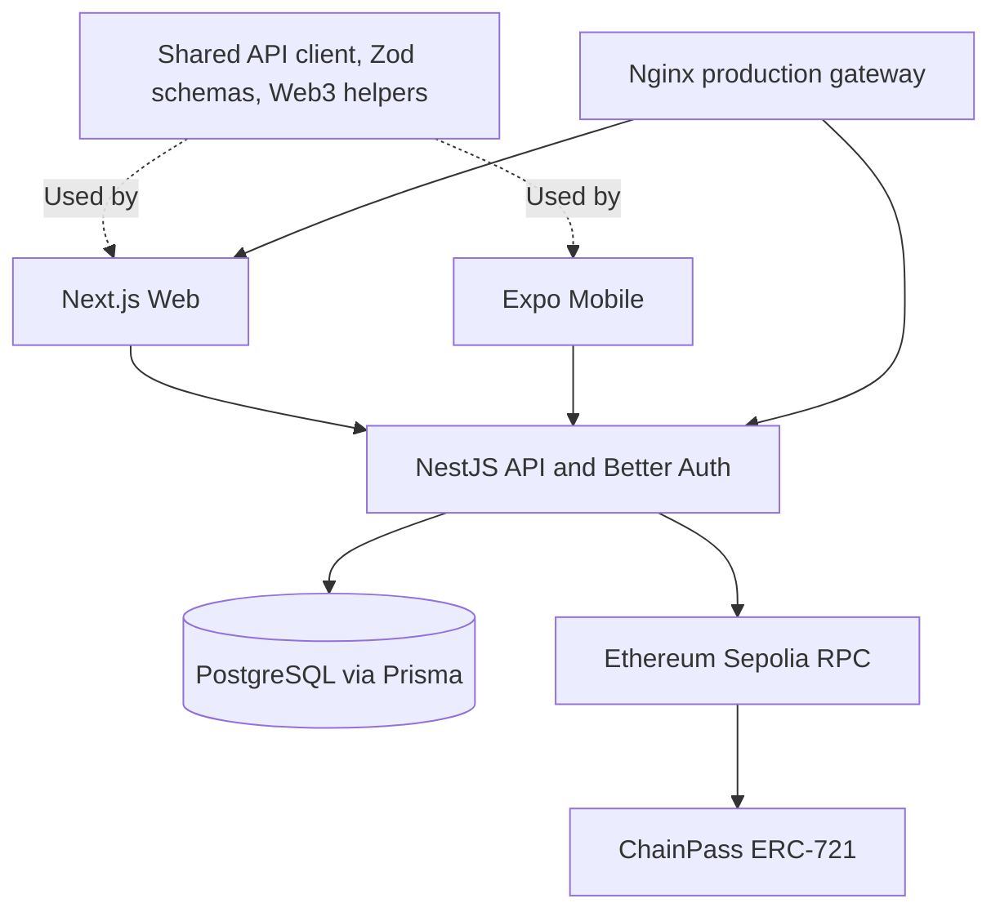

# ChainPass

**Digital event passes with verifiable wallet ownership and one-time entry.**

ChainPass connects event organizers, attendees, and door staff in one ticketing workflow: create an event, issue ticket types, claim a pass, present a rotating QR, and confirm check-in. An attendee can optionally mint their pass as a non-transferable ERC-721 on Ethereum Sepolia.

## What is ChainPass?

A ticket screenshot does not tell door staff whether it is current, who issued it, or whether it has already been used. ChainPass gives each attendee a persistent digital pass and separates checking its validity from actually admitting its holder.

Merchants create and publish events with ticket inventory. Users discover published events, claim passes, and show a short-lived entry QR. The event organizer verifies the pass and explicitly confirms check-in; the database prevents a second successful admission, including concurrent requests.

Blockchain adds a public identity and ownership record, not a replacement for the ticketing backend. A verified wallet can receive a unique token linked to a database Pass ID. Event content, inventory, attendee accounts, QR credentials, and admission status remain in PostgreSQL. **An off-chain pass is usable without a wallet, a mint, or a working blockchain RPC.**

## Core Flow

```mermaid
flowchart LR
    A[Merchant creates event] --> B[Creates active ticket type]
    B --> C[Publishes event]
    C --> D[User discovers and claims pass]
    D --> E[User presents rotating QR]
    D -. Optional .-> W[Prove wallet ownership]
    W --> M[API issuer mints ERC-721 on Sepolia]
    M --> E
    E --> V[Organizer verifies current pass]
    V --> R[Explicit check-in]
    R --> S[DB records CHECKED_IN]
    S --> U[User sees updated state]
```



Verify is read-only. Check-in is a separate write. The smart contract does **not** record check-in or revocation.

## Key Features

- **Event publishing:** organizer-owned drafts, active ticket types, public published-event discovery, and server-calculated remaining inventory.
- **Digital passes:** one claim per user and ticket type, atomic inventory allocation, personal pass list, and ticket detail.
- **Dynamic QR:** server-signed 60-second credentials, automatic refresh, expiry feedback, and tamper rejection.
- **Gate operations:** QR or manual Pass ID verification, holder/event details, explicit confirmation, and atomic one-time check-in.
- **Wallet and mint:** signature-verified wallet binding, issuer-paid Sepolia mint, receipt confirmation, explorer links, and recovery after a chain/DB write gap.
- **Role workspaces:** attendee, Merchant event/check-in workspace, and Admin user-to-Merchant promotion and platform event views.
- **Web and Mobile:** responsive Web product and Expo role-based screens sharing the same API and schemas. Native device acceptance remains distinct from browser preview and build checks.
- **Deployed system:** Dockerized Web/API/PostgreSQL behind Nginx, migrations, CI quality gates, and manually triggered production delivery.

There is no payment or refund flow. Ticket prices are stored/displayed metadata; claiming does not charge a payment. Event/ticket editing and deletion, pass transfer, and a revocation endpoint are not currently implemented.

## Product Areas

| Area | Entry points | What to demonstrate |
| --- | --- | --- |
| Public Web | `/`, `/events`, `/events/[eventId]` | Discover real published events and available ticket types |
| Attendee Web | `/login`, `/register`, `/my-passes`, `/my-passes/[passId]` | Claim, rotating QR, wallet binding, optional mint, and admission state |
| Merchant Web | `/merchant`, `/merchant/events`, `/merchant/events/new`, `/merchant/events/[eventId]`, `/merchant/check-in` | Create, issue, publish, verify, and admit |
| Admin Web | `/admin`, `/admin/users`, `/admin/events` | Inspect users/events and promote a user to Merchant |
| Mobile | Expo User, Merchant, and Admin workspaces | Native pass display, wallet/mint UI, camera/manual check-in, and role-specific navigation |

Registration always creates a normal user. Merchant access is granted by an Admin; there is no public Admin/Merchant signup option. The repository does not include product screenshots; the homepage ticket illustration is explicitly a visual preview, not an issued pass.

## Architecture Overview



## Tech Stack

Versions below reflect the application manifests; the lockfile fixes the dependency resolution.

| Layer | Implementation |
| --- | --- |
| Web | Next.js 16.3.6, React 19.2.8, Tailwind CSS 4, Base UI shadcn, TanStack Query, React Hook Form/Zod, Motion, Sonner |
| API / identity | NestJS 12, Better Auth 1.7, TypeScript ESM, Swagger/OpenAPI |
| Mobile | Expo SDK 57, React Native 0.86.3, Expo Router, NativeWind 4, Reanimated/Skia, SecureStore |
| Database | PostgreSQL 17, Prisma 7 with the PostgreSQL driver adapter |
| Blockchain | Solidity `^0.8.28`, Foundry, OpenZeppelin ERC-721/Ownable, viem; Reown/Wagmi on Web and Reown/Ethers on Mobile |
| Tooling | Node.js 24, pnpm 12.6.0, Turborepo 2 |
| Delivery | GitHub Actions, Linux/amd64 Docker images, Docker Compose, system and container Nginx |

## Repository Structure

```text
apps/
  web/          Public product and User / Merchant / Admin Web workspaces
  api/          Business API, Better Auth, Prisma schema and migrations
  mobile/       Expo app with role-based native workspaces
  telegram-mini/ Experimental Telegram Mini App
  telegram-bot/  Experimental Telegram Bot
  extension/     Experimental browser extension
  discord-bot/   Experimental Discord Bot
  wechat-mini/   Experimental WeChat Mini Program
packages/
  api-client/   Framework-independent business HTTP client
  schemas/      Shared Zod request/response boundaries
  web3/         Contract ABI, Sepolia, pass hashing and explorer helpers
  config/       Shared TypeScript configuration
contracts/      ChainPass Solidity contract, Foundry tests and deployment record
infra/          Development DB, production images/Compose, Nginx and deploy helper
.github/        CI and manually triggered Production Deploy workflows
docs/           Engineering contracts, submission documents and operations
```

## Applications

| Workspace | Purpose | Maturity |
| --- | --- | --- |
| `apps/web` | Next.js Web product | Core / production |
| `apps/api` | NestJS backend API | Core / production |
| `apps/mobile` | Expo iOS / Android application | Core client; native acceptance tracked separately |
| `@chainpass/telegram-mini` | Telegram Mini App | Experimental welcome-page scaffold |
| `@chainpass/telegram-bot` | Telegram Bot | Experimental `/start` command |
| `@chainpass/extension` | WXT browser extension | Experimental popup scaffold |
| `@chainpass/discord-bot` | Discord Bot | Experimental `/hello` command |
| `@chainpass/wechat-mini` | Taro WeChat Mini Program | Experimental welcome-page scaffold |

The five experimental platforms are workspace members, not production Docker
services or full ChainPass business clients. Default root checks retain the
existing Web/API/Mobile/shared-package scope. Run `pnpm check:platforms` explicitly
for their lint, typecheck, and build checks, or `pnpm check:all` for all workspaces.
See [Experimental Platforms](docs/EXPERIMENTAL_PLATFORMS.md) for commands and
framework compatibility boundaries.

## Getting Started

### Requirements and installation

Use Node.js 24, pnpm 12.6.0, and Docker with Compose. Foundry is needed for contract tests or a local chain, not for ordinary off-chain browsing and check-in. Native testing additionally needs a compatible device or simulator and an Expo development build for full wallet acceptance.

```bash
git clone https://github.com/Maimai10808/chainpass.git
cd chainpass
pnpm install --frozen-lockfile
cp apps/api/.env.example apps/api/.env
cp apps/web/.env.example apps/web/.env.local
cp apps/mobile/.env.example apps/mobile/.env
```

Set independent random `BETTER_AUTH_SECRET` and `QR_VERIFICATION_SECRET` in the ignored API file. Review the templates before starting; placeholders are not usable secrets. Keep local Web/API origins aligned. On a physical device, set `EXPO_PUBLIC_API_URL` to an API address the device can reach, not the device's `localhost`.

### Database and applications

The development Compose publishes PostgreSQL at host port **55432**. Production does not publish the database.

```bash
docker compose -f infra/docker-compose.yml up -d postgres
pnpm --filter api exec prisma validate --config prisma7.config.ts
pnpm --filter api exec prisma migrate deploy --config prisma7.config.ts
pnpm --filter api exec prisma generate
```

Run each app in its own terminal:

```bash
pnpm --filter api dev       # http://localhost:3001
pnpm --filter web dev       # http://localhost:3000
pnpm --filter mobile dev    # Expo / Metro
```

API health is `http://localhost:3001/health`; Swagger is `/docs` and OpenAPI JSON is `/docs/openapi.json`. The production gateway adds `/api` to business paths.

For a fresh local role demo, follow the explicitly local-only account bootstrap in [Web setup](apps/web/README.md#reusable-local-demo-accounts). Demo passwords are not stored in tracked documentation. Do not run local bootstrap or test fixtures against production.

### Optional blockchain development

The existing Sepolia contract is recorded in [sepolia.json](contracts/deployments/sepolia.json). Mint requires a reachable RPC and the authorized issuer signer in **API runtime only**. A cloned repository does not include that signer. Do not create a replacement wallet or redeploy just to run the off-chain demo.

```bash
cd contracts
forge build
forge test
```

Local Anvil deployment and opt-in integration instructions are described in [Contracts](contracts/README.md) and [Technical Details](docs/TECHNICAL_DETAILS.md#17-testing). A contract change also requires deliberate ABI synchronization with `pnpm web3:sync-abi`.

## Environment Variables

Use the tracked examples, never copy production credentials into source or build arguments.

| Template | Important keys and purpose |
| --- | --- |
| `apps/api/.env.example` | `DATABASE_URL`; Better Auth URL/secret and `WEB_ORIGIN`; `QR_VERIFICATION_SECRET`; `CHAIN_ID`, RPC, contract address, and server-only issuer key |
| `apps/web/.env.example` | `NEXT_PUBLIC_API_URL`, `NEXT_PUBLIC_AUTH_URL`, `NEXT_PUBLIC_APP_URL`; public chain/contract/Reown configuration |
| `apps/mobile/.env.example` | Reachable `EXPO_PUBLIC_API_URL`; public app, chain, contract and Reown configuration |
| `contracts/.env.example` | `SEPOLIA_RPC_URL`, public `DEPLOYER_ADDRESS`, and contract address; deployment uses a CLI signer |
| `infra/.env.production.example` | Public origin, image tag, listener binding, database settings, and API runtime secrets |

`NEXT_PUBLIC_*` values are baked into the Web build. `EXPO_PUBLIC_*` values are public client configuration. Neither may contain a private key, signing secret, database credential, or authenticated RPC URL. The API template's legacy `JWT_SECRET` is not used by the current session authentication implementation.

## Demo

1. Sign in as a Merchant; create an event with a valid start/end range.
2. Add an active ticket type with inventory; use price zero for a payment-free demo.
3. Publish. The event appears in public discovery for all attendees, including anonymous visitors.
4. Sign in as a User, open the event, and claim a pass. Open its detail from My Passes.
5. Optionally connect a Sepolia wallet, sign the server challenge, bind it, and mint. Inspect the real token and transaction on the explorer.
6. Present the rotating QR to that event's Merchant. Verify, inspect the holder/event/state, then confirm check-in.
7. Verify the same pass again: `ALREADY_CHECKED_IN`. A second check-in is rejected; the User detail refreshes to `CHECKED_IN` and no longer shows a usable QR.

The Merchant can use a manual Pass ID if camera access is unavailable. Browser scanning requires a secure context; the current public HTTP teaching deployment does not provide HTTPS camera acceptance.

## Production and Technical Deep Dive

- [Architecture & Deployment](docs/ARCHITECTURE_AND_DEPLOYMENT.md): current production snapshot, CI gates, image delivery, migrations, health checks, recovery and rollback.
- [Technical Details](docs/TECHNICAL_DETAILS.md): domain model, authorization, QR protocol, contract design and consistency.
- [Operations](docs/OPERATIONS.md): host-specific operational commands; older audit snapshots must be checked against the current deployment document.
- [Web](apps/web/README.md) / [Mobile](apps/mobile/README.md): platform setup and recorded acceptance boundaries.

The system runs on a shared Huawei Cloud teaching host. The current live release and verified health are dated in Architecture & Deployment; this is an HTTP hackathon demo on Ethereum Sepolia, not a mainnet payment service.

## Roadmap

Not currently delivered: domain/HTTPS, full native device acceptance, tested off-host backup/restore, faster image distribution, and issuer-key custody/rotation. Event/ticket editing, a revocation workflow, transfers, payments and refunds would require separate product work; they are not implied by the current UI or schema.

## License

Licensing is not yet consolidated: the root manifest declares ISC, the API manifest says `UNLICENSED`, Solidity sources use MIT SPDX identifiers, and the Mobile starter retains [Expo's MIT notice](apps/mobile/LICENSE). No top-level `LICENSE` file is present. These documents do not establish a new repository-wide license grant.
