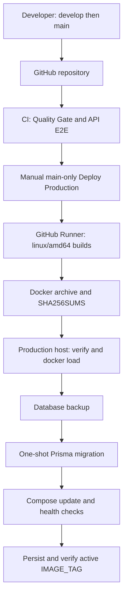
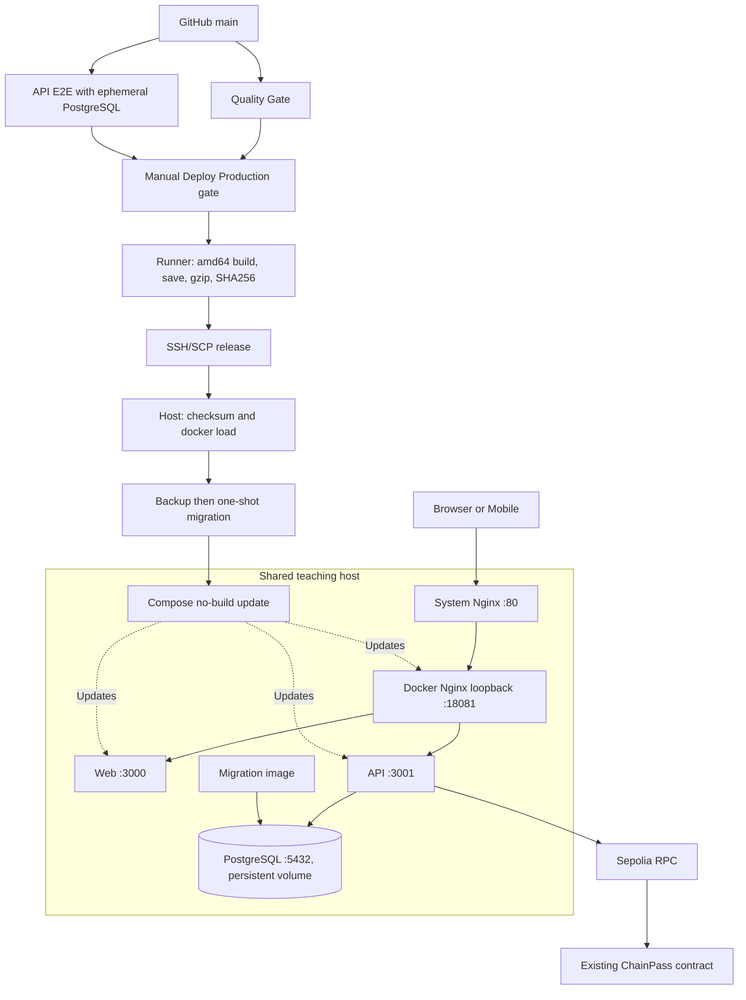
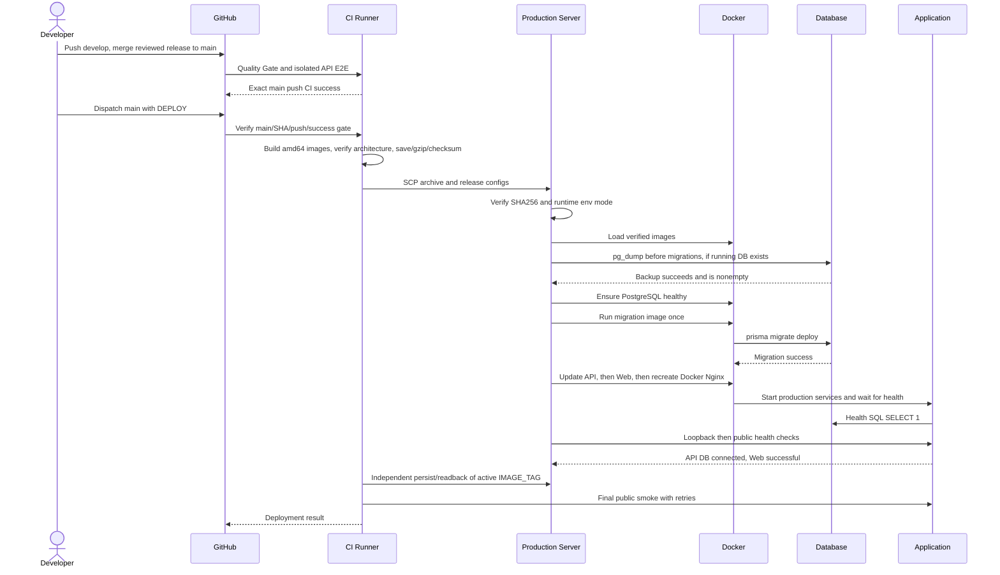

# ChainPass Architecture & Deployment

The source-to-production reference for the hackathon submission. Product behavior is described in [README](../README.md); domain, authorization and blockchain internals are in [Technical Details](./TECHNICAL_DETAILS.md). Host-specific operational references remain in [Operations](./OPERATIONS.md).

This document separates **implemented automation**, **observed production state**, and **future improvements**. The production audit below was performed on **2026-10-07**. It is a dated snapshot, not a permanent health guarantee. No deployment, secret rotation or resource cleanup was performed while writing these documents.

## 1. Big Picture



The shared Huawei Cloud teaching host **does not build project images**. GitHub Actions is the default delivery path; an authorized Mac/CI-built archive is the emergency fallback. Mobile and Solidity deployment are outside this Compose release.

### Verified production snapshot

| Item | Observed result |
| --- | --- |
| Source | `develop @ d14dccc`; production `main @ f1c35de`; source trees match at audit time |
| Host | Ubuntu 24.04, `linux/amd64`, shared Huawei Cloud ECS |
| Active release | `20261007-f1c35de`, consistent with running application images and env tag |
| Containers | PostgreSQL, API, Web, Docker Nginx all healthy |
| Public and loopback smoke | Web HTTP 200; API `{"status":"ok","database":"connected"}` |
| Database | Six migrations finished; existing volume retained |
| Runtime environment | `/home/chainpass/.env.production`, mode `600` |
| Backup | Nonempty `pre-20261007-f1c35de.dump`, mode `600` |
| Shared services | Existing `:8080` and `:10010` returned 200; Swarm remained active |
| Capacity | Approximately 6.4 GiB free disk; 1.5 GiB available RAM; no swap |

Evidence: [main push CI](https://github.com/Maimai10808/chainpass/actions/runs/37632195065) succeeded. [Production Deploy attempt](https://github.com/Maimai10808/chainpass/actions/runs/37632774513) built and checked the images but was **cancelled during SCP before remote loading/deployment**. The current release was delivered through the documented Mac emergency path, with checksums, backup, migrations, health checks and explicit tag persistence. Its host-local `RELEASE_NOTES.txt` records that distinction. It is not a successful end-to-end GitHub deployment run.

The previous release has a [successful automated run](https://github.com/Maimai10808/chainpass/actions/runs/37453088818). Older `DEPLOYMENT.md` / `OPERATIONS.md` snapshots describe October 6 and an earlier tag/gate mismatch; the current workflow contains both the strict main CI query and independent tag-persistence step. Use the current implementation and dated evidence above when those historical notes conflict.

The submission documents intentionally omit the real host address, personal SSH configuration and credentials. Authorized operators obtain the public origin/access details from the existing operational configuration; examples below use `<public-origin>` or environment variables.

## 2. Development Architecture

The local path is: clone → pnpm install → ignored env files → Docker PostgreSQL → existing migrations/client generation → API → Web/Expo. Commands are listed in [Getting Started](../README.md#getting-started), not duplicated here.

- Node 24 and pnpm 12.6.0 match CI and Docker tooling.
- Workspaces are `apps/*` and `packages/*`; Turbo orchestrates lint/typecheck/tests/builds.
- Development PostgreSQL 17 binds `55432:5432`; API defaults to `3001`, Web to `3000`.
- Native Mobile uses a device-reachable API URL. SecureStore remains the Session store.
- Off-chain claim/entry does not require Anvil or a Sepolia signer. Chain mint requires deliberate server-side configuration.
- Contract tests use Foundry separately; root `pnpm build` is not a contract or native distribution build.

This submission baseline is the committed Web/API/Mobile system. Additional untracked app directories present during the October 8 continuation are concurrent work, not evidence of an accepted or deployed integration. Workspace/lockfile edits for those apps were preserved and are not part of this documentation change.

Local quality checks corresponding to the existing workflows:

```bash
pnpm --filter api exec prisma generate
pnpm lint
pnpm typecheck
pnpm test
pnpm build
```

E2E additionally needs an **isolated test database**, configured before applying migrations and running `pnpm --filter api test:e2e`. Do not point test teardown at a production/developer database you intend to preserve.

## 3. Source-to-Production Pipeline

1. Develop and verify locally on `develop`.
2. Push authorized commits; CI runs Quality Gate and API E2E.
3. Merge the intended release into `main`; wait for that exact commit's successful **push** CI.
4. Run **Deploy Production** manually on `main`, typing `DEPLOY`.
5. Runner builds/tag-checks all Linux/amd64 images, packages and checksums the release.
6. SSH/SCP transfers the release; the host verifies checksums before loading.
7. Back up the running production database before migration.
8. Use a temporary runtime env copy with the new tag; run the no-build helper.
9. Wait for PostgreSQL, migration, API, Web and Docker Nginx in order.
10. Check loopback routes, then the public system-Nginx routes.
11. Independently persist/read back the active tag, preserving env mode `600`.
12. Runner performs a final public smoke check.

Normal front/backend updates do not require manual server source edits, builds, SCP, image loading or restarts. Manual actions that remain: approve/trigger release, manage runtime secrets, host Nginx/TLS, restore/rollback decisions and emergency recovery.

## 4. CI Quality Gate

[`ci.yml`](../.github/workflows/ci.yml) runs on pushes to `develop`/`main`, PRs targeting them, and manual dispatch. Both jobs have 30-minute timeouts. Same-ref older CI can be cancelled by a newer run.

**Quality Gate** uses Node 24/pnpm 12.6.0:

```text
frozen-lockfile install
→ Prisma generate
→ pnpm lint
→ pnpm typecheck
→ pnpm test
→ pnpm build
```

It supplies CI-only database/build values, not production secrets. Root scripts use Turbo and run each workspace's defined tasks; shared packages without a build script do not acquire an invented build step. API unit tests are distinct from API E2E. Foundry, browser wallet/camera and native hardware tests are not part of this job.

The deployment gate queries successful `ci.yml` workflow runs with **all four filters**: `branch=main`, `head_sha=$GITHUB_SHA`, `event=push`, `status=success`. A develop or PR success cannot satisfy it. This is a workflow-run gate, not a promise that every repository protection rule requires every status before merging.

## 5. API E2E

The separate job starts an ephemeral PostgreSQL `17-alpine` service, published to runner port 5432 with `pg_isready` health checks. It installs dependencies, generates Prisma, applies existing migrations using `--config prisma7.config.ts`, then runs the E2E Vitest configuration.

Tests create Nest test applications using `bodyParser: false` and Supertest; CI does not start a separate long-running API process. Test fixtures are scoped/cleaned by test code, and the runner service is ephemeral at job completion.

CI explicitly sets `BLOCKCHAIN_INTEGRATION=false`. Mint and check-in E2E use a replaced BlockchainService; ordinary CI needs neither a public RPC nor a Sepolia private key. The opt-in Anvil integration is skipped. The current local acceptance record reports 79 tests passing with one opt-in skip; a successful exact-main CI run was verified for this submission, but its detailed test count was not independently downloaded during this audit.

## 6. Docker Architecture

| Image | Purpose | Build and runtime | Port |
| --- | --- | --- | --- |
| `chainpass-api:<tag>` | NestJS business/Auth runtime | Node 24 Alpine; prune/install/generate/build/prod dependency deployment; non-root runner | 3001, internal |
| `chainpass-api-migrate:<tag>` | One-shot schema migration | Node 24 Alpine; Prisma 7.10.0 CLI, schema/config/migrations; non-root `prisma` user | None |
| `chainpass-web:<tag>` | Next.js product | Node 24 Alpine; pruned workspace build; standalone output; non-root runner | 3000, internal |
| `chainpass-nginx:<tag>` | Application reverse proxy | Nginx 1.27 Alpine; config copied into image | Container 80; host loopback 18081 |
| `postgres:17-alpine` | Persistent database | Official runtime image, not built by the project | 5432, internal |

Sources: [API Dockerfile](../apps/api/Dockerfile), [Web Dockerfile](../apps/web/Dockerfile), [Nginx Dockerfile](../infra/nginx/Dockerfile), [Compose](../infra/docker-compose.prod.yml).

The root is the API/Web build context because both use workspace dependencies. `.dockerignore` excludes real env files, Git/history, dependencies/caches, Mobile, contracts and docs from those contexts. Nginx has its own small context.

API packaging copies `schemas` and `web3` source outside `node_modules` and points package symlinks there: Node cannot type-strip TypeScript from inside the deployed `node_modules` tree. The Web runner copies standalone output, public assets and `.next/static`, then runs `apps/web/server.js`. Neither runs a dev server.

The migration image is a distinct target containing the CLI and migration assets; the API runner need not carry a migration toolchain. Its command is:

```text
prisma migrate deploy --config prisma7.config.ts
```

### Build-time vs runtime configuration

Web images receive `NEXT_PUBLIC_API_URL`, `NEXT_PUBLIC_AUTH_URL`, `NEXT_PUBLIC_APP_URL`, `NEXT_PUBLIC_CHAIN_ID`, `NEXT_PUBLIC_CHAINPASS_CONTRACT_ADDRESS` and optional Reown ID as build arguments. Changing only server env cannot change an old browser bundle.

API runtime alone receives `DATABASE_URL`, `BETTER_AUTH_SECRET`, `QR_VERIFICATION_SECRET`, `CHAIN_RPC_URL` and `DEPLOYER_PRIVATE_KEY`. The signer is never a Docker ARG, Web env or image layer. Compose derives API Auth URL/trusted Web origin from `PUBLIC_URL`. The template's example domain is a placeholder, not current HTTPS infrastructure.

## 7. Image Tag Strategy

Workflow tag format is **UTC `YYYYMMDD-<first seven characters of GITHUB_SHA>`**. For example, main `f1c35de…` maps to `20261007-f1c35de`, release directory and the four app/migration image tags.

The authoritative deployed state requires three matching pieces:

```text
main commit → release files / tagged images → running containers
                                           ↘ persisted IMAGE_TAG
```

Only image loading is not a production switch. A successful deploy helper does not itself persist the tag. The independent **Persist active release tag** workflow step changes only that public env field, enforces `600`, and reads it back. Final checks must compare env and running images.

Same-day retries of the same commit produce the same tag and paths. Rebuilt mutable base images can change bits without changing the tag; archives/checksums identify the actual payload. There is no run-unique immutable release identifier or digest pinning policy. The PostgreSQL runtime tag is not release-specific.

## 8. Artifact Transfer

The workflow saves five images, gzips them, and packages:

```text
chainpass-images-<IMAGE_TAG>.tar.gz
docker-compose.prod.yml
teaching-server.conf
deploy.sh
SHA256SUMS
```

`SHA256SUMS` covers the archive and the three configuration/script files. Runtime env, SSH keys and database contents are not packaged. SCP sends the files into the tag-specific release directory; the host runs `sha256sum --check SHA256SUMS` before `gzip -dc ... | docker load`.

The latest complete archive was about **818 MiB**. Full archives repeat unchanged layers. GitHub-hosted Runner → China host SCP can be the slowest step: the latest attempt transferred roughly 54 MiB before cancellation because its rate could not finish within the 60-minute workflow window. A quiet SCP step for several minutes alone is not evidence of a hung deployment.

There is currently no registry push/pull, resumable-transfer protocol, automatic incomplete-release cleanup or detailed SCP progress reporting in the workflow. Recovery must inspect current state first; see section 18.

## 9. Production Server Layout

```text
/home/chainpass/
├── .env.production                      # Runtime secrets; mode 600; outside release
├── backups/
│   └── pre-<IMAGE_TAG>.dump              # Sensitive PostgreSQL custom-format backup
└── releases/
    └── <IMAGE_TAG>/
        ├── chainpass-images-<IMAGE_TAG>.tar.gz
        ├── SHA256SUMS
        ├── docker-compose.prod.yml
        ├── teaching-server.conf
        └── deploy.sh
```

The latest emergency release also contains public `RELEASE_NOTES.txt` and preserved transport/partial artifacts. Those are diagnostic leftovers, not required application resources, and were not deleted in this audit.

The host does not need a Git checkout, pnpm, Node build tools or Mobile artifacts. Retain historical release files/images needed for a deliberate rollback. The release directory is not a backup of PostgreSQL.

## 10. Database

Production PostgreSQL 17 belongs to Compose project **`chainpass`**, volume **`chainpass_postgres_data`**, mounted at `/var/lib/postgresql/data`. It has no host-port mapping and is only on the internal backend network.

Use the same project name on every update. The file/helper defaults are `chainpass-prod`; production calls override them explicitly to avoid creating a second volume/stack.

Credentials come from server env. The API/migration datasource uses service name `postgres`, not host `localhost`. Normal updates keep the volume and apply forward migrations; they do not initialize an empty replacement or reset tables. A Docker volume is persistence, **not a backup**.

## 11. Database Backup Before Deploy

The workflow locates the running `chainpass` PostgreSQL container by Compose project/service labels. Before invoking migration it runs container-local `pg_dump -Fc`, saves `backups/pre-<IMAGE_TAG>.dump`, and checks command success/file nonzero size.

If no running database container is found, the workflow skips backup, supporting first installation. It does not determine whether an inaccessible existing volume contains important data. Operators must stop/review an unexpected missing database rather than treat this skip as a recovery guarantee.

Backup permission hardening is not explicit in the workflow: new files inherit the remote shell's umask. The latest emergency backup was set to `600`; protect all backups and their parent directory separately. Same-tag reruns overwrite the same backup path unless an operator preserves it first. No off-host backup, scheduled retention, full restore drill or automated restore validation is implemented.

For an **authorized manual backup** on the host, without printing credentials:

```bash
umask 077
backup="/home/chainpass/backups/manual-$(date -u +%Y%m%dT%H%M%SZ).dump"
docker exec chainpass-postgres-1 \
  sh -c 'pg_dump -U "$POSTGRES_USER" -d "$POSTGRES_DB" -Fc' > "$backup"
test -s "$backup"
chmod 600 "$backup"
```

Backups contain user/session data and are sensitive even though they do not contain the API issuer env. Never add them to release packages or Git. Verify restore on an isolated target before relying on a backup for recovery.

## 12. Database Migration

Existing schema changes originate in development: edit schema → generate/review migration → commit with application changes → CI test → main → release. Do not generate migrations on the production host.

Compose declares migration depends on healthy PostgreSQL, API on migration completion and healthy PostgreSQL. The helper explicitly runs a one-shot migration after PostgreSQL health, then starts API with `--no-deps`, because the migration has already run and its `--rm` container is gone.

`prisma migrate deploy` applies pending committed migrations; an already-current database is a successful no-op. Nonzero migration exit stops the helper/workflow before application updates. Successfully committed DDL is not rolled back automatically when a later step fails.

Never use production `migrate dev`, reset, or `down -v`. A failed migration needs diagnosis of Prisma migration state and the specific DDL/data issue, not a blanket retry or database recreation.

## 13. Runtime Architecture

```text
Internet :80 → System Nginx
                    ↓
             127.0.0.1:18081 → Docker Nginx
                                    ├── Web :3000
                                    └── API :3001
                                           ├── PostgreSQL :5432
                                           └── Sepolia RPC → ChainPass contract
```

- `chainpass_edge`: Nginx/Web/API; API has external RPC connectivity through this network.
- `chainpass_backend`: API/migration/PostgreSQL, marked `internal: true`.
- Only Docker Nginx publishes a port, loopback-only behind the host gateway.
- API/Web/PostgreSQL have no public bindings; `expose` is not a host-port mapping.
- Long-running services use `restart: unless-stopped`; migration uses `restart: "no"`.
- Existing host Swarm is unrelated: ChainPass uses Compose, not a Swarm stack.

The public service currently uses HTTP only. No domain/certificate/TLS deployment is claimed. SSH access is operational access, not another application entry point.

## 14. Nginx

[`teaching-server.conf`](../infra/nginx/teaching-server.conf) describes the separately installed host site: port 80 → `127.0.0.1:18081`, Host/real-IP/forwarded headers and 180-second read timeout. Existing teaching sites are not replaced. Installing/updating this site requires separate review, `nginx -t`, then reload, not a routine application release.

[`default.conf`](../infra/nginx/default.conf) is baked into the Docker Nginx image:

| Public path | Upstream behavior |
| --- | --- |
| `/healthz` | Nginx-local 200; not application/DB health |
| `/api/auth/*` | Preserves full path to Better Auth |
| `/api/*` | Strips `/api/` and proxies to NestJS business routes |
| `/` | Next.js; includes Next static asset requests |
| `/api`, `/api/auth` | 308 redirects to slash-ending paths |

Both proxy layers use HTTP/1.1, forwarding headers, 2 MiB body limit and 180-second read timeout for synchronous mint receipt waits. No WebSocket/SSE requirement is implemented. Docker Nginx is force-recreated after application updates so its upstream resolution follows replaced containers.

TLS is future work. Both layers currently derive forwarded protocol from their local scheme; terminating HTTPS at the outer layer requires auditing preservation into the inner layer, Better Auth cookies/origins and rebuilt public URLs. Simply adding a certificate or changing env is not full HTTPS acceptance.

## 15. Health Checks

| Check | What it proves | What it does not prove |
| --- | --- | --- |
| PostgreSQL `pg_isready` | Server accepts connections | Correct migration/data/business state |
| API `/health` | Request succeeds and SQL `SELECT 1` works | Signer balance, RPC/contract availability or auth flow |
| Web `/` | Next server responds successfully | Browser hydration/session/mint behavior |
| Nginx `/healthz` | Nginx local config serves a route | Upstreams healthy |
| Gateway `/api/health`, `/` | Routing plus API DB and Web reachability | Full business/device acceptance |

Container health commands use local Node fetch for API/Web and wget for Nginx. The helper waits for services and checks gateway routes with `curl --fail`; workflow additionally checks the public origin remotely and from Runner (five retries, three-second delays). Curl's error check is not a business response validator and does not reject every redirect; inspect expected response/status/body as part of acceptance.

Read-only operator checks, using an already authorized host session:

```bash
docker ps --filter label=com.docker.compose.project=chainpass \
  --format '{{.Names}} {{.Image}} {{.Status}} {{.Ports}}'
grep '^IMAGE_TAG=' /home/chainpass/.env.production
curl --fail --silent --show-error http://127.0.0.1:18081/api/health
curl --fail --silent --show-error --output /dev/null \
  --write-out '%{http_code}\n' http://127.0.0.1:18081/
```

From a client set `PUBLIC_URL` to the authorized public origin, then test `${PUBLIC_URL%/}/api/health` and `/`. Never print the whole production env or a Compose config that interpolates secrets; use `config --quiet`.

## 16. Production Switch

The helper validates config and **all required loaded images** before startup. Its actual sequence is:

```bash
compose up -d --no-build --wait postgres
compose run --rm --no-deps --pull never migrate
compose up -d --no-build --no-deps --wait api
compose up -d --no-build --no-deps --wait web
compose up -d --no-build --no-deps --force-recreate --wait nginx
```

The workflow supplies a temporary mode-600 copy of production env with the new IMAGE_TAG and deletes that copy on exit. Persistent secrets are not rewritten by the helper. Production uses `CHAINPASS_COMPOSE_PROJECT=chainpass`, the release Compose path, correct env file, and loopback smoke URL.

Service replacement updates the single live stack; there is no blue/green environment, atomic traffic switch or guaranteed zero downtime. API may be new while Web/Nginx are still old. Runtime availability precedes the independent env tag persistence; final tag and container inspection resolves that distinction.

## 17. Rollback

**Automatic:** shell failure stops remaining steps. No automated image/DB rollback exists. Before service update, build/transfer/checksum/backup failures normally leave the prior runtime untouched. Migration failure may have altered DB state; API/Web/startup/smoke failures can leave a partially updated stack.

**Manual application rollback, only after authorization:**

1. Identify a known-good historical release and its corresponding images/archive.
2. Review current migration state and compatibility with the old application; old code may not work with a forward-migrated schema.
3. If images are missing, verify that old release's checksum and load its archive; do not rebuild on the server.
4. Override IMAGE_TAG explicitly and use that release's Compose with the same project/volume. Replace API → Web → force-recreate Nginx with `--no-build --no-deps --wait`; do not blindly run an old migration image as a rollback.
5. Verify container/public/business health and existing teaching services.
6. Persist only the recovered public tag and retain mode `600`; record the rollback.

Example application restart fragment, executed on the host only after steps 1–3:

```bash
export IMAGE_TAG="<known-good-tag>"
release_dir="/home/chainpass/releases/${IMAGE_TAG}"
compose() {
  docker compose -p chainpass \
    --env-file /home/chainpass/.env.production \
    -f "${release_dir}/docker-compose.prod.yml" "$@"
}
compose config --quiet
compose up -d --no-build --no-deps --wait api
compose up -d --no-build --no-deps --wait web
compose up -d --no-build --no-deps --force-recreate --wait nginx
```

This fragment does not persist the tag or restore DB. Application rollback is **not database rollback**. Prefer a reviewed forward repair migration. Database restore requires an explicit downtime/data-loss decision, a verified backup, and a separate audited procedure. No automatic reverse Prisma migration is supplied.

## 18. Release Directory & Deployment Recovery Principles

First determine the failed layer: build, transfer, load, backup, migration, service replacement, smoke, or tag persistence. Avoid restarting the entire pipeline because a transfer is quiet.

- Inspect Actions job/step and remote process/file sizes without exposing secrets. A growing archive and live SCP are progress, not a dead build.
- A partial `.tar.gz` is not loadable; do not deploy until its final checksum and companion configs match. Current SCP has no built-in resume guarantee.
- Stop conflicting writers before replacing a partial archive. If delivery changes to the authorized emergency path, use the exact reviewed source/platform/public build config and its own complete checksum set; do not mix files from different builds.
- If a complete verified archive/images already exist, continue from loading/preflight or the failed service step rather than rebuilding API/PostgreSQL or transferring again.
- Prisma handles already-applied migrations as a no-op, but failures/partial DDL must be inspected before retry. Backups can be overwritten by same-tag retries.
- If containers are healthy but tag persistence failed, verify images/health first, then repair only the public tag field. Do not deploy again just to repair metadata.
- Keep evidence of an emergency delivery. A cancelled Actions run cannot be relabeled successful because another path later completed.

This is an operational recovery discipline, not a implemented resumable-deploy engine. The latest emergency path was: Mac Linux/amd64 images → isolated local production Compose smoke → save/gzip/SHA256 → SCP → remote verify/load → backup → no-build helper → public health → tag/readback.

## 19. Observability and Shared-Host Safety

Current tools: Actions jobs/logs, `docker ps`, service-scoped `docker logs`/Compose logs, API/Web/Nginx health, Nginx logs, `docker stats --no-stream`, `free -h`, `df -h`, and `docker system df`. No Prometheus, Grafana, tracing platform or automated paging is installed by this project.

For logs use the active release Compose and project `chainpass`; filter/redact before sharing, because application/auth logs can contain sensitive information. For example:

```bash
active_tag="$(sed -n 's/^IMAGE_TAG=//p' /home/chainpass/.env.production | tail -n 1)"
docker compose -p chainpass --env-file /home/chainpass/.env.production \
  -f "/home/chainpass/releases/${active_tag}/docker-compose.prod.yml" \
  logs --tail 100 api
```

Compare the persisted tag with actual containers first. Starting/stopping one service is a write operation and is not implied by permission to inspect logs.

### Danger / Do Not

Only operate on explicitly identified ChainPass resources. Preserve pawlice-report, flow-lab, other project directories/configs and existing Swarm.

- No server project builds, global Docker prune, volume/network prune, Swarm leave, or Docker daemon stop/restart.
- No `down -v`, database reset, removal of `chainpass_postgres_data`, or production `prisma migrate dev`.
- No printing/copying production env, cookies, private keys, passwords or authenticated RPC URLs into tickets/docs/Git.
- Do not occupy existing teaching ports `8080` / `10010` or publish `18081`, `3000`, `3001`, `5432` externally.
- Do not replace other Nginx sites or clean their project resources to free RAM/disk.
- Do not remove old release/image/backup files without explicit retention/rollback review and cleanup authorization.

## 20. Current Production Architecture Diagram



`edge` connects Nginx/Web/API; only API/migrate/PostgreSQL join the internal `backend`. The diagram shows application deployment, not a Swarm/contract deployment or Mobile distribution pipeline.

## 21. Full Deployment Sequence Diagram



The sequence is the intended automated success path. The latest cancelled SCP run did not reach its remote steps; the current release completed via emergency delivery. Failure stops the sequence, not an automatic rollback.

## 22. Failure Scenarios

| Failure | Detection | Current handling | Recovery |
| --- | --- | --- | --- |
| Quality Gate / E2E fails | CI red | Successful exact-main gate unavailable | Fix source/tests; rerun correct main CI |
| Wrong branch/confirmation | Job condition / gate | Deployment skipped or rejected | Dispatch main with exact confirmation |
| Docker build / architecture fails | Build exit / inspect | Stop before packaging/remote update | Fix and build off-host; never retry Web build on shared host |
| SSH / SCP interrupted or too slow | Actions step / file progress | Stops/cancels; partial files may remain | Inspect processes/artifact; authorized complete transfer, no blind restart |
| Checksum mismatch | SHA256 command | Stop before docker load | Replace mismatched files with one consistent verified release |
| Required image missing | Helper preflight | Stop before startup | Verify/load already-built correct images |
| Database backup fails | pg_dump or nonempty check | Stop before migration | Diagnose DB/disk/permissions; preserve existing data |
| No running DB detected | Label lookup | Backup skipped | Distinguish first install from outage before proceeding |
| Migration fails | One-shot exit | Stop before app update; prior DDL may persist | Inspect migration state; reviewed forward repair |
| API/Web/Nginx startup fails | Compose wait / health | Stops with potentially mixed versions | Diagnose scoped logs/config; explicit compatible rollback |
| Gateway/public smoke fails | Curl / health body | Job fails, no automatic rollback | Check application, proxy, listener and access rules in that order |
| Active-tag persistence fails | Independent readback | Job fails; new containers may already serve | Verify runtime, repair tag only with authorization |
| Final external check fails | Runner curl retries | Job fails after tag may be persisted | Separate runner network failure from public/runtime outage |
| Blockchain RPC unavailable | Business error/advisory status | Mint unavailable; off-chain entry still allowed | Read-only RPC/chain diagnosis; authorized runtime-provider change |

## 23. Known Limitations

- Single host/shared resources; no HA, resource-isolated build workers on the host, blue/green, zero-downtime guarantee or automated rollback.
- HTTP/no TLS; production browser QR camera and secure transport remain pending.
- Large full image archives and cross-border SCP dominate release time; unchanged layers are retransferred, and the 60-minute window can be insufficient.
- Same-tag retries can overwrite artifacts/backups; checksums help identify payloads but no immutable digest/tag policy exists.
- Backups are same-host, with no automated permissions/retention/restore drill or off-host copy. Database rollback is not implemented.
- Capacity/retention is manual: the latest audited disk was 84% used. Do not solve this by global shared-host prune.
- CI does not run full production Compose locally on Runner, Foundry or native/browser hardware acceptance. The latest emergency release did receive separate local production Compose smoke.
- Runtime secret provisioning/rotation, system Nginx, TLS, issuer funding/custody and Mobile distribution remain deliberate manual operations.
- Health checks verify application/DB availability, not complete auth/mint/business correctness. Sepolia/provider availability remains an external dependency.

## 24. Future Architecture Improvements

These are suggestions, **not current infrastructure**:

| Current | Possible next step |
| --- | --- |
| Save/gzip/SCP/load whole archive | Reachable container registry (GHCR or domestic registry), pull only changed layers |
| Date/SHA tag with same-day reuse | Immutable image digests and run-specific release records |
| Single-instance sequential replacement | Reviewed blue/green or another low-downtime strategy after measuring need |
| Same-host manual-retention dumps | Protected off-host backups and periodic isolated restore tests |
| Forward migrations + manual rollback | Expand/contract migrations and explicit application/schema compatibility |
| HTTP teaching demo | Domain/TLS plus end-to-end forwarded-proto, Cookie, wallet and camera acceptance |
| Scoped logs and endpoint checks | Lightweight alerts/telemetry driven by observed failures, not a prebuilt monitoring platform |
| Raw issuer runtime key and synchronous mint | Audited key custody/rotation and durable receipt/reconciliation work |

Any improvement should preserve the existing API/Auth boundaries, shared-host isolation and observable acceptance criteria. A registry, new branch model, cluster or contract redeployment must not be inferred from this document.
