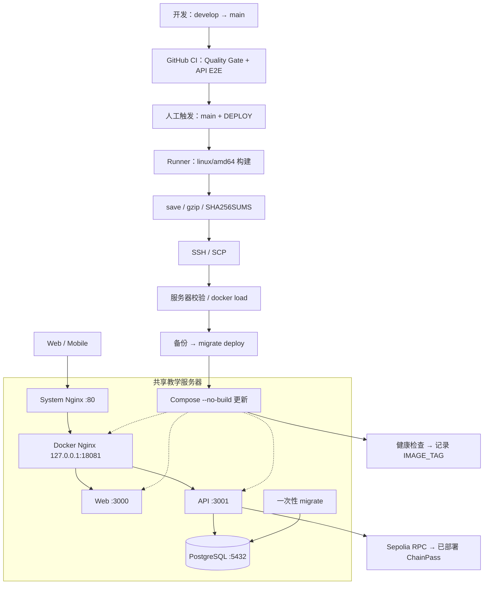
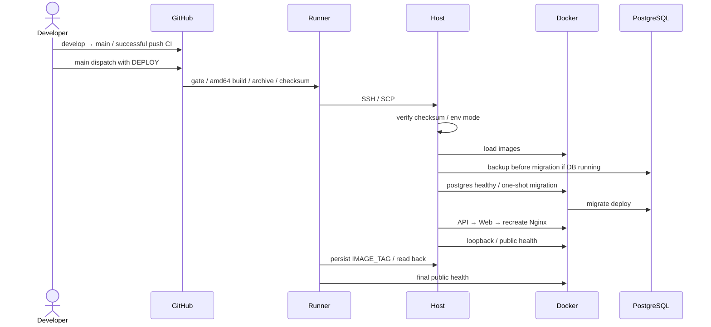
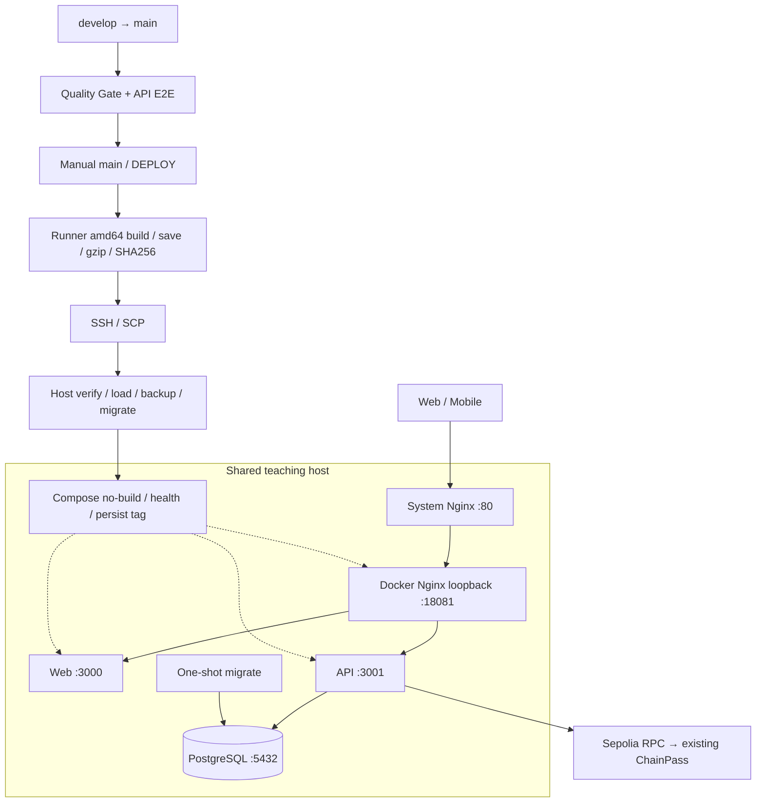
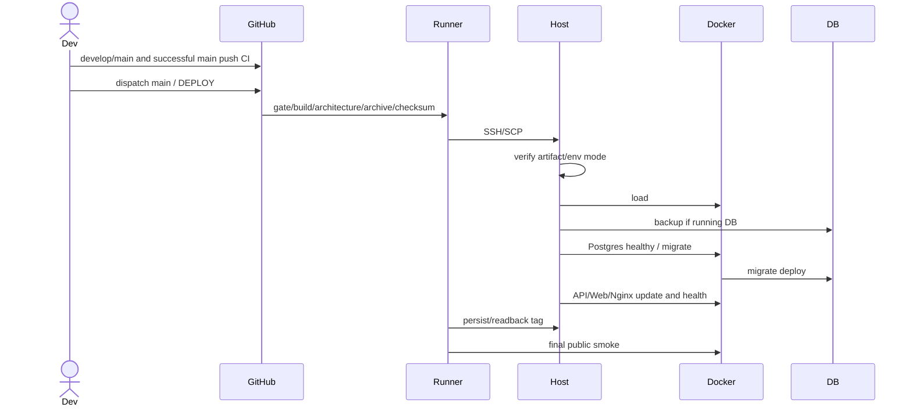

# ChainPass 架构与部署 / Architecture & Deployment

[中文](#zh) · [English](#en)

<a id="zh"></a>

## 中文

这是源码到生产的工程参考；[README](../README.md#zh)介绍产品，[技术细节](./TECHNICAL_DETAILS.md#zh)解释业务，[部署指南](./DEPLOYMENT.md#zh)提供镜像操作，[运维](./OPERATIONS.md#zh)提供日常 Runbook。依据 2026-10-08 仓库实现；本轮未访问或更新服务器。

### 1. 完整架构



服务器**不构建项目镜像**。Mobile 分发与 Solidity 部署不在应用 Compose/CD 内。ChainPass 使用 Compose，不使用共享宿主机已有的 Swarm。

### 2. 本地开发与 CI

本地安装、env、PostgreSQL、Prisma、API/Web/Expo 命令见[快速开始](../README.md#zh)。Node 24、pnpm 12.6.0 与 Docker/CI 一致；PostgreSQL 开发端口为 55432，API 默认 3001，Web 默认 3000。

`.github/workflows/ci.yml` 在 develop/main push、目标为这两者的 PR、手动 dispatch 时运行。两 job 独立、各 30 分钟；同 ref 新 CI 可取消旧运行。

| Job          | 真实步骤                                                                                 |
| ------------ | ---------------------------------------------------------------------------------------- |
| Quality Gate | frozen install → Prisma generate → pnpm lint → typecheck → test → build                  |
| API E2E      | 临时 PostgreSQL 17 healthy → install → generate → migrate deploy → Nest/Supertest/Vitest |

根质量命令只检查 Web/API/Mobile/packages；五个实验端使用 opt-in 检查，但安装仍解析共享 lockfile。E2E 在测试进程创建 Nest app（bodyParser:false），不启动独立长期 API。测试 DB 是隔离的，任务结束由 Runner 回收。普通 CI 设置 BLOCKCHAIN_INTEGRATION=false，不需 Sepolia Secret；不跑 Foundry、浏览器硬件或原生真机。

### 3. Production Deploy 门槛与步骤

`deploy-production.yml` 仅手工 workflow_dispatch，job 要求 refs/heads/main 且输入精确 DEPLOY。生产 concurrency 串行且不自动取消上一轮，timeout 60 分钟。

main CI gate 同时筛 **branch=main、head_sha=$GITHUB_SHA、event=push、status=success**，不能借用 develop 同 SHA 的成功。当前代码已有独立 **Persist active release tag** step；这是实现事实，不是本轮已运行该 step 的声明。

默认日常路径：

```text
develop 开发/验证 → 授权 commit/push → develop CI
→ 合入 main → 该 main push CI
→ Actions / Deploy Production / main / DEPLOY
→ build / transfer / backup / migrate / update / health / tag
```

普通更新不需要人工 SSH 改源码、构建、SCP/load 或重启。首次 Secret/SSH、系统 Nginx、TLS、回滚与紧急交付仍由人工管理。

### 4. 镜像与配置

| 镜像                        | 真实打包方式                                                                                |
| --------------------------- | ------------------------------------------------------------------------------------------- |
| chainpass-api:<tag>         | Node 24 Alpine；Turbo prune、Prisma generate、Nest build、prod dependencies；非 root runner |
| chainpass-api-migrate:<tag> | API Dockerfile migrate target；Prisma 7.10 CLI + schema/config/migrations，one-shot         |
| chainpass-web:<tag>         | Node 24 Alpine；pruned workspace build、Next standalone，非 root runner                     |
| chainpass-nginx:<tag>       | Nginx 1.27 Alpine，仅代理配置                                                               |
| postgres:17-alpine          | 官方 linux/amd64 runtime                                                                    |

API/Web build context 为仓库根；生产依赖采用 isolated + Turbo prune，不依赖开发机 hoisted 布局。API 把 schemas/web3 源码放到 node_modules 外，再链接，避免 Node 对 node_modules 内 TS type-strip 的限制。Web runner 使用 apps/web/server.js、standalone/public/static，不运行 next dev。

`.dockerignore` 排除真实 env、Git、产物、Mobile、五个实验端、contracts/docs/infra；Docker Nginx 单独使用 infra/nginx context。锁文件/根配置仍可能使缓存失效，不等于实验依赖进入 runtime。

Web 的 NEXT_PUBLIC_API_URL/AUTH_URL/APP_URL、CHAIN_ID、CONTRACT_ADDRESS、REOWN_PROJECT_ID 在 **build-time** 注入；修改服务器 env 不会改变旧 bundle。API runtime 才接收 DATABASE_URL、BETTER_AUTH_SECRET、QR_VERIFICATION_SECRET、CHAIN_RPC_URL、DEPLOYER_PRIVATE_KEY。Compose 从 PUBLIC_URL 派生 Auth/WEB_ORIGIN。没有 Secret build ARG。

### 5. Tag、归档与服务器目录

tag = UTC **YYYYMMDD-<Git SHA 前七位>**；四张应用/migration image、release 目录和 env tag 对应。PostgreSQL 不使用 release-specific tag。

```text
/home/chainpass/
├── .env.production                 # Secret，mode 600
├── backups/pre-<IMAGE_TAG>.dump     # 敏感 DB 备份
└── releases/<IMAGE_TAG>/
    ├── chainpass-images-<IMAGE_TAG>.tar.gz
    ├── SHA256SUMS
    ├── docker-compose.prod.yml
    ├── teaching-server.conf
    └── deploy.sh
```

Runner 按顺序构建 API/migrate/Web/Nginx、拉 Postgres、检查全部 linux/amd64，再 docker save | gzip。SHA256SUMS 覆盖归档和三个配套文件；SCP 后服务器校验再 load。Secret、DB、SSH key 不入归档。没有 registry 或断点续传机制。

同一天重跑同一 SHA 复用 tag，可能覆盖 release/备份；基础镜像可变，tag 不是内容 digest。跨境 SCP、大完整归档、重复传不变层是现实限制；几分钟静默不等于失活，不能直接重跑全流程。

### 6. 数据库、备份与启动

生产 project 必须显式 **chainpass**；Compose/helper 默认 chainpass-prod，不能误创建第二个 volume。生产卷 chainpass_postgres_data 挂载 /var/lib/postgresql/data；无 host port，backend 为 internal，API 的 edge network 可访问外部 RPC。

Workflow 先按 project/service label 找运行的 PostgreSQL，执行 pg_dump -Fc 到 pre-<tag>.dump 并检查非空。未找到运行 DB 会跳过备份：只适合明确首装，不能把故障数据库当空环境。备份权限依赖 umask，workflow 未显式 chmod；同 tag 可覆盖备份。无异机备份、保留策略或自动恢复演练。**Volume 不是 backup。**

在临时 mode-600 env 副本只替换 IMAGE_TAG；helper config --quiet、检查所有镜像已 load，执行：

```bash
compose up -d --no-build --wait postgres
compose run --rm --no-deps --pull never migrate
compose up -d --no-build --no-deps --wait api
compose up -d --no-build --no-deps --wait web
compose up -d --no-build --no-deps --force-recreate --wait nginx
```

migration 运行 prisma migrate deploy --config prisma7.config.ts；失败即停止，不能用 migrate dev/reset/down -v。helper 不负责备份、系统 Nginx、永久 tag、回滚或清理。Nginx 重建以重新解析被替换的 upstream。

### 7. 路由与健康检查

System Nginx 是公网入口；Docker Nginx 的唯一 host mapping 是 loopback :18081。Web/API/DB 不向宿主机暴露 3000/3001/5432。

| 路径/检查          | 含义                                              |
| ------------------ | ------------------------------------------------- |
| /healthz           | Docker Nginx 自身返回 200，不证明 upstream        |
| /api/auth/*        | 保留完整路径给 Better Auth                        |
| /api/*             | 去掉 /api/ 给 NestJS 普通业务路由                 |
| /                  | Next.js（包括静态资源）                           |
| API /health        | SELECT 1，返回 status:ok/database:connected       |
| pg_isready / Web / | DB 接受连接 / Web server 响应，不等于完整业务验收 |

两层 HTTP/1.1、Host/real-IP/forwarded headers、2MiB body limit、180 秒 read timeout 支持同步 Mint 等待。无应用 WebSocket/SSE。常驻容器 restart unless-stopped；migration restart no。

helper 检查 loopback API/Web，workflow 远端及 Runner 检查公网，最后独立持久化 tag/readback（600）并再检查公网。最终必须对齐**实际运行镜像、release、env IMAGE_TAG**。load 本身不代表上线，健康不代表 Wallet/Mint/QR 全验收。

HTTP 无 TLS 是已记录教学架构；HTTPS 需审核两层 forwarded-proto、Cookie/Origin、最终 build URL 和相机，不能只加证书就宣称完成。

### 8. 回滚与故障恢复

没有自动 rollback 或 blue/green；顺序替换可能短时混合版本/停机。失败停止后续步骤：
构建/传输/checksum/备份失败通常未动应用；migration 后可能已改 DB；启动/health/tag 失败可能新服务已经运行。

回滚必须人工确认旧镜像/目录、当前 schema 兼容性；只以旧 tag/no-build 替换 API/Web/Nginx，**不盲目执行旧 migration helper**。应用回滚不反向 Prisma DDL；优先 forward repair，DB restore 另需审核停机/丢数据风险。命令见[运维](./OPERATIONS.md#zh)。



| 故障                            | 处理起点                                                               |
| ------------------------------- | ---------------------------------------------------------------------- |
| CI/gate/build/architecture 失败 | 修正确切 SHA 的源码/测试；服务器不构建                                 |
| SCP 慢/中断                     | 查 step、进程、文件大小；部分归档不 load，不开启冲突传输               |
| checksum/缺镜像                 | 完整交付后复核/load，不猜 tag                                          |
| backup/migration 失败           | 停止；查 DB/磁盘/权限/migration 状态，保留数据                         |
| service/health 失败             | 查 ChainPass scoped logs、loopback、系统入口、访问规则                 |
| tag 漂移                        | 先查运行镜像；授权后仅修公开 tag，不重跑整个部署                       |
| RPC 不可达                      | API 内脱敏只读 chain/code/owner 检查；授权换 runtime RPC，不重部署合约 |

若已有完整归档或 loaded image，从失败层继续；不要重复构建 API/重建 PostgreSQL。取消 Actions 后经紧急路径完成上线，不能把取消 run 改称成功。

### 9. 历史生产证据与运维边界

保留的 **2026-10-07** 审计记录：20261007-f1c35de、四容器 healthy、loopback/公网 Web HTTP 200、API DB connected、当时的六个 migrations、env / backup 权限 600、其他服务 8080/10010 正常、Swarm active。该记录不证明后来新增邀请 migration 已在生产应用。

[main CI](https://github.com/Maimai10808/chainpass/actions/runs/37632195065)成功；[该次 Deploy](https://github.com/Maimai10808/chainpass/actions/runs/37632774513)在 SCP 阶段取消，最终通过 Mac 应急路径交付；此前[自动发布](https://github.com/Maimai10808/chainpass/actions/runs/37453088818)有成功记录。本轮未再查 GitHub/服务器，因此不声称当前 live tag/CI 状态。

现有观察工具是 Actions、docker ps/logs/stats、nginx logs、health、free/df/system df。无 Prometheus/Grafana/自动告警。生产 SSH/Secret、system site、TLS、issuer 资金/托管、保留/回滚、Mobile 分发是人工边界。

共享主机禁止全局 prune、Swarm leave、重启 Docker、down -v、生产 migrate dev、打印 env、占用 8080/10010 或修改其他项目。只操作经确认的 chainpass 资源。

### 10. 已知限制与未来建议

当前：单机共享资源、HTTP、大归档/SCP、不支持自动恢复/回滚、同机备份、手工 Secret、缺完整硬件验收，health 不测试链上业务。历史容量是快照，不能当今天可用空间。

未来可评估 registry 增量 pull、不可变 digest、异机备份/恢复演练、expand/contract migration、TLS 与低停机发布、按需求轻量监控、issuer 托管与 receipt worker。**这些都未实现**，不能混入当前架构或未经授权部署。

---

<a id="en"></a>

## English

This source-to-production reference links to [product](../README.md#en), [technical internals](./TECHNICAL_DETAILS.md#en), [image delivery](./DEPLOYMENT.md#en) and [operations](./OPERATIONS.md#en). It reflects source on 2026-10-08; no host visit/update occurred in this edit.

### 1. Architecture



The host never builds project images. Compose deploys neither Mobile nor Solidity; the host's unrelated Swarm is not ChainPass infrastructure.

### 2. Development and CI

Use [quick start](../README.md#en). Node 24/pnpm12.6.0 match Docker/CI; development Postgres binds55432, API3001, Web3000.

ci.yml triggers on develop/main pushes, PRs targeting them and dispatch. Two independent 30-minute jobs: Quality Gate (frozen install, Prisma generate, lint/typecheck/test/build); API E2E (ephemeral Postgres17 health, install/generate/migrate deploy, Nest/Supertest/Vitest). Same-ref newer runs can cancel older CI.

Root tasks filter core Web/API/Mobile/packages; experimental checks are opt-in, though shared installation still resolves them. E2E creates Nest apps with bodyParser:false inside tests and uses an isolated DB. BLOCKCHAIN_INTEGRATION=false means no Sepolia secret; Foundry, hardware and production transactions are outside CI.

### 3. Production gate and release flow

deploy-production.yml is dispatch-only, requiring refs/heads/main and exact DEPLOY. Production runs serialize without cancellation; timeout60minutes. The gate filters branch=main, head_sha=$GITHUB_SHA, event=push, status=success. Develop CI cannot substitute.

Current source has an independent Persist active release tag step; source inspection is not proof it ran in this edit. Standard flow: develop/local checks/authorized push → develop CI → reviewed main → exact main push CI → manual dispatch → build/transfer/backup/migrate/update/health/tag.

Ordinary updates require no manual SSH source edits, builds, SCP/load or restarts. Initial secrets/SSH, host Nginx, TLS, rollback and emergency delivery remain manual.

### 4. Images and configuration

API uses Node 24Alpine, Turbo prune, Prisma/Nest build and prod deployment, with non-root runner. Migration is a distinct Prisma 7.10 CLI/schema/config/migrations target. Web uses pruned Next standalone/public/static and non-root server.js. Nginx1.27Alpine supplies routing; postgres17-alpine is official runtime. All five images must be linux/amd64.

Root context serves API/Web; isolated/pruned installation avoids development hoisting. API schemas/web3 sources live outside node_modules with symlinks for Node TS stripping. dockerignore excludes secrets, Git/output, Mobile, experimental apps, contracts/docs/infra; Nginx has a separate context. Shared lock/config can invalidate cache without adding experimental runtime dependencies.

Web NEXT_PUBLIC API/Auth/App URLs, chain/contract and Reown ID are build-time. Server env changes cannot alter old bundles. DATABASE_URL, Auth/QR secrets, RPC and issuer key are API-runtime-only; PUBLIC_URL derives API Auth/WEB_ORIGIN. No secret ARG exists.

### 5. Tags and artifacts

Tag = UTC YYYYMMDD-seven-character-SHA; application/migration images, release directory and env tag correspond. Postgres uses its fixed runtime tag.

```text
/home/chainpass/
├── .env.production                 # runtime secrets, 600
├── backups/pre-<IMAGE_TAG>.dump     # sensitive DB dump
└── releases/<IMAGE_TAG>/
    ├── chainpass-images-<IMAGE_TAG>.tar.gz
    ├── SHA256SUMS
    ├── docker-compose.prod.yml
    ├── teaching-server.conf
    └── deploy.sh
```

Runner sequentially builds API/migration/Web/Nginx, pulls Postgres, inspects platform, saves/gzips and checksums the archive plus three companion files. Host verifies before load. Env, DB and SSH keys are never packaged. No registry/resumable transfer exists.

Same-day same-SHA retries reuse paths and may overwrite backup/artifacts; mutable base tags mean release tags are not content digests. Cross-border full-archive SCP is a real bottleneck; minutes without logs do not justify starting over.

### 6. Database and startup

Always use project chainpass on production; file/helper defaults chainpass-prod, which would create different resources. chainpass_postgres_data persists at /var/lib/postgresql/data, without host port. backend is internal; edge gives API external RPC connectivity.

Before migration, workflow label-selects a running DB, pg_dump -Fc to pre-tag.dump and checks nonempty. A missing running DB skips backup, suitable only for known first installation—not recovery from an outage. Permission inherits umask; workflow does not chmod backups. Same-tag runs may overwrite them. Off-host backup, retention and restore drills are absent. A volume is not a backup.

A temporary mode600 env changes only IMAGE_TAG. Helper config --quiet/image preflight precede:

```bash
compose up -d --no-build --wait postgres
compose run --rm --no-deps --pull never migrate
compose up -d --no-build --no-deps --wait api
compose up -d --no-build --no-deps --wait web
compose up -d --no-build --no-deps --force-recreate --wait nginx
```

Migration runs prisma migrate deploy --config prisma7.config.ts. Failure stops; never use production migrate dev/reset/down -v. Helper does not back up, persist tag, manage system Nginx, roll back or clean resources. Nginx recreation resolves current upstreams.

### 7. Routing and health

System Nginx owns public80; Docker Nginx binds loopback :18081 only. Web/API/DB do not publish host3000/3001/5432.

healthz checks Nginx itself; /api/auth/* preserves Better Auth prefix; ordinary /api/* strips it for Nest; / goes to Next. API health executes SELECT1 and returns status:ok/database:connected. pg_isready/HTTP health prove availability, not migrations, signer/RPC or full business acceptance.

Both layers forward Host/IP/protocol, use HTTP1.1, 2MiB bodies and180-second read timeout for mint. No app WebSocket/SSE. Long-running services restart unless-stopped; migrate does not.

Helper checks loopback; workflow checks public remotely, independently persists/readbacks tag with600, then Runner retries public smoke. Running images/release/env IMAGE_TAG must match. Load alone is not release success. HTTP/TLS is a separate acceptance boundary; forwarded-proto/cookies/origins/build URLs/camera need review when adding HTTPS.

### 8. Failure, switch and rollback

No automated rollback/blue-green exists. Sequential replacement may cause mixed versions/downtime. Build/transfer/checksum/backup failures usually precede application mutation; migrations may persist DDL; startup/health/tag failures may occur after new services run.

Manual rollback verifies old images/release and current schema compatibility, then replaces only API/Web/Nginx with old tag/no-build. Do not blindly rerun an old migration helper. Application rollback does not reverse DDL; reviewed forward repair or separately authorized restore is required. See [runbook](./OPERATIONS.md#en).



CI/gate/build failures require source fixes, not host builds. SCP failures require progress/partial-file inspection; checksum/image failures stop startup. Backup/migration failures require data-preserving DB/disk/permission investigation. Service failures use scoped logs/loopback/host access checks. Tag-only drift should be repaired separately after runtime verification. RPC failures need redacted API-side reads/authorized provider changes, never contract redeployment.

Continue from a verified existing archive/image or failed step rather than rebuilding API/Postgres. Emergency completion does not turn a cancelled Actions run into a successful one.

### 9. Historical evidence and safety

The retained 2026-10-07 audit records release20261007-f1c35de, four healthy containers, Web HTTP 200/API DB-connected, six migrations at that time, env / backup 权限 600, other ports8080/10010 healthy and Swarm active. It does not establish production application of the later invitation migration.

[Main CI](https://github.com/Maimai10808/chainpass/actions/runs/37632195065) succeeded; [that deploy](https://github.com/Maimai10808/chainpass/actions/runs/37632774513) was cancelled during SCP and completed by Mac emergency delivery. [An earlier automated run](https://github.com/Maimai10808/chainpass/actions/runs/37453088818) succeeded. No live GitHub/host check occurred here.

Observability is Actions, scoped Docker/Nginx logs, ps/stats, endpoints and free/df/system df—not Prometheus/Grafana/paging. Host SSH/secrets/site/TLS, issuer funding/custody, retention/rollback and Mobile distribution remain manual.

Never globally prune, leave Swarm, restart Docker, down -v, production migrate dev, print env, occupy8080/10010 or modify others' resources. Operate only on authorized, identified chainpass resources.

### 10. Limits and future work

Current limits: shared single host, HTTP, large repeated archives/SCP, no automatic rollback/resume, same-host backups/manual secrets and hardware acceptance gaps. Health is not full chain/business proof; historical capacity is not current space.

Possible future work—not implemented—includes reachable registry/incremental pulls, immutable digests, off-host backup/restore drills, expand/contract migrations, TLS/low-downtime releases, measured telemetry and issuer custody/receipt workers. None authorizes new infrastructure or deployment.
