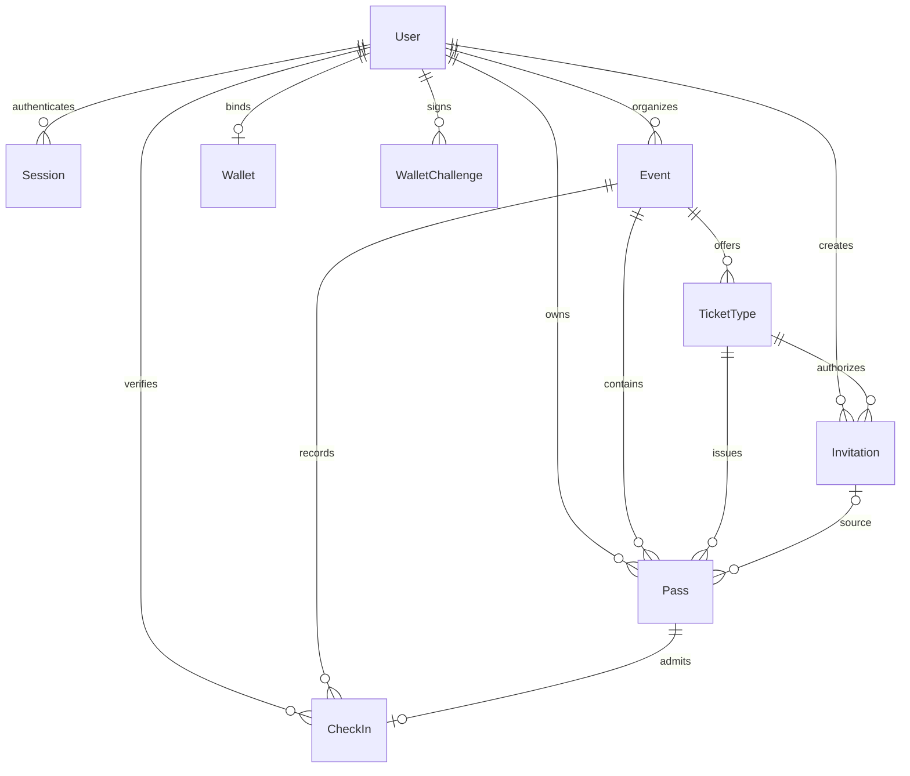
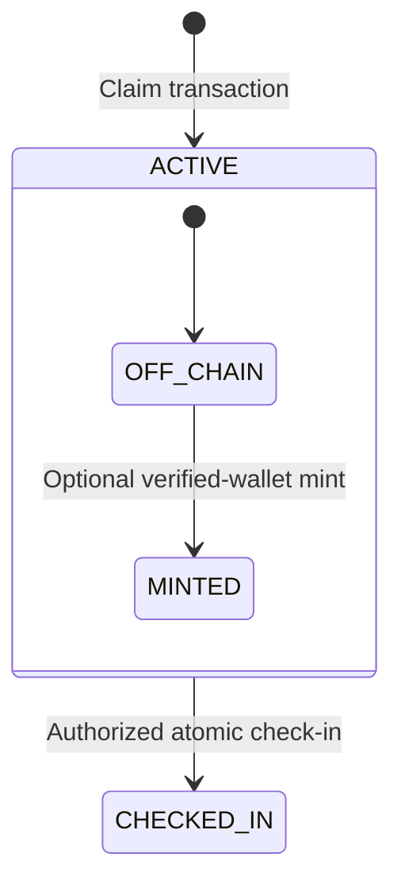

# ChainPass 技术细节 / Technical Details

[中文](#zh) · [English](#en)

<a id="zh"></a>

## 中文

本文解释当前代码如何实现业务闭环；运行与发布见[架构与部署](./ARCHITECTURE_AND_DEPLOYMENT.md#zh)。依据 2026-10-08 本地仓库，不将当前分支等同于生产版本。

### 1. 系统与 Monorepo

Web（Next.js 16/React 19）和 Mobile（Expo 57/React Native 0.86）通过共享 Client 调用 NestJS 12。Prisma 7/PostgreSQL 17 保存业务数据；Viem 连接 Ethereum Sepolia。Better Auth 1.7 是唯一用户/Session 系统。

pnpm 12.6.0 发现 `apps/*`、`packages/*`，本地采用 hoisted 布局。Turbo 编排任务；默认根命令显式限定 Web/API/Mobile 与共享包，实验端只能主动通过 `check:platforms`、`build:all`、`check:all` 纳入。过滤任务不隔离整个 workspace 的依赖解析。

| 共享包       | 职责                                                                            |
| ------------ | ------------------------------------------------------------------------------- |
| `api-client` | 框架无关的集中 HTTP 调用、错误和 Zod 响应校验；目前手工维护，不是自动生成流水线 |
| `schemas`    | 跨进程请求/响应 Zod Schema 与类型，不直接导出 Prisma Model                      |
| `web3`       | ABI、Sepolia、地址规范化、Pass hash 与 Explorer helper                          |
| `config`     | 共享工程配置，不持有运行时 Secret                                               |

五个实验端是最小入口，不具备完整票务能力，见[实验平台](./EXPERIMENTAL_PLATFORMS.md#zh)。Web/Native UI 各自维护。

### 2. 领域模型

真实模型是 `User`、`Session`、`Account`、`Verification`、`Event`、`TicketType`、`Invitation`、`Pass`、`Wallet`、`WalletChallenge`、`CheckIn`。Merchant/Admin 是 User 的角色，不是独立用户表。



关键约束：User email 唯一；Wallet 的 userId/address 各自唯一；Pass 的 `(ticketTypeId, ownerId)`、`(contractAddress, tokenId)`、mintTxHash 唯一；CheckIn.passId 唯一；Invitation.tokenHash 唯一。价格用 BIGINT 存储、十进制字符串返回，时间用带时区 ISO 8601 返回。

当前有七个已提交 migration；旧记录由新增邀请 migration 保持 PUBLIC，Create Event API 默认 INVITE_ONLY。Schema 的 PUBLIC 默认用于历史/导入兼容，不等于新 API 的默认行为。

### 3. 活动与票种

Event 只有 DRAFT/PUBLISHED，没有自动 Ended/Archived 状态。TicketType 只有 ACTIVE/INACTIVE；现有创建 API 默认 ACTIVE，不提供活动编辑/删除或票种更新 API。

`EventsService.publish()` 检查归属、合法时间范围和至少一个 ACTIVE 票种；缺票种返回 `EVENT_HAS_NO_ACTIVE_TICKET_TYPES`。重复发布返回已有 Event。

`GET /events` 和公开详情只读取 **PUBLIC + PUBLISHED**；Draft/邀请制详情按未找到处理。管理查询独立：`/events/mine` 仅当前 organizer，`/events/admin` 显式 admin-only，`/:id/manage` 与管理票种列表检查 organizer/admin。普通 event read 权限不能访问其他商家的 Draft。

### 4. 邀请与领取

商家只能给自己的已发布邀请制活动创建邀请，绑定活动下一个 ACTIVE 票种。服务器生成 32 字节随机 base64url token；数据库仅存 SHA-256 hash。创建响应只返回一次原始 token，后续列表不可恢复。邀请有 maxUses/usedCount、expiresAt、revokedAt。

匿名 `POST /invitations/resolve` 接收 body token，只返回活动、organizer name、指定票种及剩余次数，不扣库存、不预留名额。链接可转发，不绑定指定实名用户。撤销只影响未来领取。

`PassesService.claim()` 在同一 PostgreSQL 事务内：

1. 确认已发布、票种 ACTIVE，邀请制要求有效且匹配票种的 token。
2. 检查当前 Session owner 是否已领取该票种。
3. 条件更新邀请次数：未撤销、未过期且未超额。
4. 条件扣库存：claimedCount < totalSupply。
5. 创建独立 ACTIVE Pass，并记录可空 invitationId。

失败回滚次数、库存与 Pass。唯一约束防止竞争请求重复领取。多个邀请指向同一票种会共享库存，而不是各有一套票。价格目前仅为元数据；非零价格也不会触发支付。

Web 用 `/invite#token=…`，登录 next 只含 `/invite`，当前 tab sessionStorage 交接凭证，领取成功或主动清除后移除。独立 Web 没有额外的 30 分钟保留上限。

Mobile 支持粘贴链接和 `chainpass://invite#token=…`：原生 SecureStore、Mobile 的 Expo Web 预览 sessionStorage，保留上限为 30 分钟或已知服务器有效期。新链接替换旧凭证；成功、退出、身份/角色变化或邀请失效后清除。两端资格都以服务器为准，Token 不放进 Auth 返回地址或 Query key；API 用 POST body/no-store。没有 HTTPS Universal Links/App Links 或专门邀请限流。

### 5. Pass 生命周期



Mint 写入元数据，不改变 ACTIVE；CHECKED_IN 是数据库入场状态，不 burn Token。Schema 还定义 REVOKED，核验会处理它，但当前没有 Pass 撤销 API，不能把图外的规划状态当作可操作功能。

### 6. 核验、QR 与核销

QR 是临时凭证，不是数据库真相。API 仅允许 ACTIVE Pass owner 生成，60 秒有效：

```text
base64url(JSON({ v: 1, passId, ownerId, nonce, iat, exp }))
.
HMAC-SHA256(encodedPayload, QR_VERIFICATION_SECRET)
```

它不含 Email、Session Cookie、钱包私钥或可信 status。签名不是加密，Payload 可读。服务器检查签名长度/constant-time 比较、payload、版本和 expiry，重新查询 Pass/owner，再调用与手工 Pass ID 相同的 Verify Service。

过期为 `QR_TOKEN_EXPIRED`，篡改为 `INVALID_QR_TOKEN`。有效期内可以重复只读核验；不建一次性 QR 表。Merchant 仍只能操作自己的活动，Admin 可跨活动核验。

Verify 返回 VALID / ALREADY_CHECKED_IN / REVOKED / INVALID，以及 Event、票种、Holder、已有 verifier/time。链上增强状态是 NOT_MINTED / VERIFIED / MISMATCH / UNAVAILABLE；**MISMATCH/UNAVAILABLE 当前不阻止业务有效的 Off-chain 核销**。

Check-in 不自动发生。确认后同一事务条件执行 ACTIVE → CHECKED_IN，并创建唯一 CheckIn，verifiedById 来自 Session，method 为 QR 或 MANUAL。重复/并发冲突返回 `PASS_ALREADY_CHECKED_IN`。扫码只解析凭证，不能直接修改 Pass。

Web/Native 在可见且前台时约每五秒刷新持票状态；foreground/refetch 后隐藏已核销 QR，不是 WebSocket 实时推送。扫码器在检测、切换模式、失焦/后台或卸载时清理摄像头，锁定重复帧；摄像头失败保留手工模式。

### 7. 钱包与链上 Mint

钱包绑定不是 Wallet Login。五分钟 challenge 绑定 Session、规范化地址、chain ID、nonce 和 message；个人签名经 `recoverMessageAddress` 校验后，在事务中一次性消耗并写入 Wallet。连接不等于绑定，当前没有解绑/换绑或 EIP-1271 合约钱包验证。

当前链为 Ethereum Sepolia `11155111`，合约 `ChainPass` / `CPASS`：
`0xbA3e9bCbe448E928c5e71f4bE6415E7e0e3E5ABb`。公开部署、owner、源码 Sourcify exact_match 与测试 Token #1 见 [sepolia.json](../contracts/deployments/sepolia.json)；地址从 runtime env 注入，不复制到多份业务代码。

合约仅 owner 可调用 `mintPass(address, bytes32)`；`passHash = keccak256(UTF-8 Pass.id)`，映射防重复，`PassMinted` 事件提供恢复依据，ERC-721 Transfer 提供 Mint 记录；非零地址之间 transfer 被禁止。活动、票种、库存、邀请、QR、核销均不上链。

API issuer 支付 gas，recipient 来自已验证 Wallet，客户端不能指定 owner/recipient。ACTIVE owner 请求 Mint → 先检查已有 DB/链映射 → 发送交易 → 等待一次确认 → 解析事件 → 校验 ownerOf → 写回 chainId/contractAddress/tokenId/mintTxHash。大整数用字符串传输。

### 8. 一致性与失败恢复

`PassesService.mint()` 使用基于 Pass ID 的 transaction advisory lock（maxWait 10 秒、timeout 120 秒），序列化同 Pass 请求。链成功、DB 失败时无法撤销交易；重试通过 tokenIdByPassHash、ownerOf 和从 block 0 查询的 PassMinted 日志恢复，不再次 Mint。

这不是跨链/数据库原子事务，也没有持久 pending tx、outbox、后台 receipt worker、跨 Pass nonce 调度或完整 reorg 处理。等待外部链会占用 DB 事务/连接；RPC 日志范围限制可能影响恢复。

My Passes 的 `ON_CHAIN_VERIFIED` 表示完整持久化 Mint 元数据，不是在每次列表展示时重新读取 RPC。Merchant Verify 才可额外查当前 ownerOf；不要混淆两种证据。

### 9. API 与身份边界

API 按 Feature 聚合 Controller、DTO、Service、Module；Prisma 使用生成到 `src/generated/prisma` 的 Client 与 PrismaPg adapter，NodeNext/ESM 保留 `.js` import。Swagger 为 `/docs`、`/docs/openapi.json`。

唯一规则：Session → Permission → Ownership → Business Rule。公开注册默认 user，Merchant 由 Better Auth Admin API 提升；Admin 初始配置必须明确授权。Body 不能决定 organizerId、ownerId、verifiedById 或 role。

输入/输出由共享 Zod 与 DTO 控制；无统一成功 envelope。业务错误提供 HTTP status/code/message，客户端不能展示原始 SQL/stack/provider credential。接口表见 [API 契约](./API_CONTRACT.md#zh)，Auth 细则见[身份架构](./AUTH_ARCHITECTURE.md#zh)。

### 10. Web 与 Mobile

Web 是 App Router + client Session/Query/mutation，Base UI shadcn、RHF/Zod、Sonner、semantic tokens 与克制 Motion。Reown/Wagmi 签 challenge，API Mint；QR 用 qrcode.react，Scanner 用 ZXing。当前 Hero/Pass 主要是 CSS/Motion，不依赖必须可用的 WebGL。auth-test 只重定向 login。

Mobile 使用 Expo Router 角色工作区、NativeWind 4/Native Components、Reanimated/Skia；Better Auth Expo Session 在 SecureStore。WalletConnect namespaced AsyncStorage 仅存连接元数据。Query 私有 key 含 User ID，身份改变清缓存，mutation 不自动重试。QR 在内存中，过期前十秒刷新，后台/失焦清除；原生分享、深链与相机生命周期见 [Mobile](../apps/mobile/README.md#zh)。

两端不导入 Prisma，不复制库存、邀请、Mint 或核销逻辑。实验端没有业务调用。完整 Native 钱包验收使用 development build；不宣称所有依赖都可在 Expo Go 中验收。

### 11. 测试与验收证据

| 层         | 命令与范围                                                      |
| ---------- | --------------------------------------------------------------- |
| API unit   | `pnpm --filter api test`，Vitest                                |
| API E2E    | `pnpm --filter api test:e2e`，Nest/Supertest/隔离 PostgreSQL    |
| Web/Mobile | 各自 `test`，Node 纯逻辑/视觉规则测试                           |
| Web3       | `pnpm --filter @chainpass/web3 test`，链/hash/地址/Explorer     |
| 合约       | `cd contracts && forge test`，issuer、重复 Mint、归属、不可转让 |

普通 E2E 替换 BlockchainService。真实链集成文件只有 BLOCKCHAIN_INTEGRATION=true 才执行，应显式使用隔离 Anvil，不给普通 CI 配置 Sepolia 私钥。CI 不跑 Foundry、摄像头/钱包硬件或真实生产交易。

已记录的 2026-10-08 本地邀请验收为 API E2E 93 passed / 1 skipped（串行，先前并行受构建负载超时）、Mobile 25 纯测试、根质量检查与 iOS/Android Hermes export，通过真实本地 API/DB 的 Expo Web 邀请/领取/QR/核销。未在本次文档修改中重跑这些业务验收。原生系统分享、SecureStore 进程重启、安装深链、相机和钱包跳转仍需真机证据。

Sepolia 历史应用 Mint、浏览器角色验证与设备限制分别记录在 [Web](../apps/web/README.md#zh) / [Mobile](../apps/mobile/README.md#zh)，不等同于每个 release 的生产验收。

### 12. 安全与取舍

已实现 Session/RBAC/Ownership、Schema 校验、事务与唯一约束、一次性 Wallet challenge、签名/过期 QR、issuer-only Mint 和不可转让。Origin/CSRF 保持开启，issuer/Auth/QR Secret 只在 API runtime。

限制包括 HTTP 教学入口无 TLS、QR 在 TTL 内可复制、可转发邀请不是实名邀约、无专门限流/WAF/Email 验证 onboarding、无 issuer custody/rotation 服务、同步 Mint 不适合高并发。单服务器、轮询、可选上链和无 QR 表是当前明确取舍，不是金融级安全或高可用承诺。

---

<a id="en"></a>

## English

This is the implementation reference; [Architecture & Deployment](./ARCHITECTURE_AND_DEPLOYMENT.md#en) owns delivery. Facts reflect local source on 2026-10-08, not proof this branch is live.

### 1. System and monorepo

Next.js 16/React 19 Web and Expo 57/React Native 0.86 Mobile call NestJS 12 through shared contracts. Prisma 7/PostgreSQL 17 own business data; Viem connects Sepolia; Better Auth 1.7 is the only User/Session system.

pnpm 12.6.0 discovers apps/* and packages/* with a hoisted local layout. Default Turbo root commands explicitly filter Web/API/Mobile/shared packages. Experimental clients require check:platforms/build:all/check:all; task filtering does not isolate dependency resolution.

api-client centralizes framework-independent HTTP/errors/Zod response parsing and is currently handwritten, not generated. schemas contains boundary schemas/types, not Prisma records. web3 contains ABI/chain/address/hash/explorer helpers; config contains engineering configuration, never secrets. UI stays platform-local. See [experimental workspaces](./EXPERIMENTAL_PLATFORMS.md#en).

### 2. Domain model

Actual models: User, Session, Account, Verification, Event, TicketType, Invitation, Pass, Wallet, WalletChallenge and CheckIn. Merchant/Admin are User roles, not separate identity tables.


Unique constraints protect user email, wallet user/address, Pass(ticketTypeId, ownerId), Pass(contractAddress, tokenId), mintTxHash, CheckIn.passId and Invitation.tokenHash. Prices are database BIGINT/decimal response strings; dates are timezone-qualified ISO 8601.

Seven committed migrations exist. The invitation migration preserves legacy PUBLIC events; Create Event defaults to INVITE_ONLY. The schema PUBLIC default is compatibility for legacy/imported records, not the API default.

### 3. Events and tickets

Event states are DRAFT/PUBLISHED, without automatic Ended/Archived. TicketType states are ACTIVE/INACTIVE; creation defaults ACTIVE. Event edit/delete and ticket update APIs are absent.

EventsService.publish checks ownership, valid dates and at least one ACTIVE ticket, otherwise EVENT_HAS_NO_ACTIVE_TICKET_TYPES. Repeat publication returns the existing event.

Public list/detail select only PUBLIC + PUBLISHED; draft/private detail returns not found. Management is separate: mine is organizer-scoped, admin explicitly admin-only, manage and ticket management list enforce organizer/admin. Generic event-read permission does not expose other organizers' drafts.

### 4. Invitations and claims

A merchant creates invitations for an ACTIVE ticket of their own published INVITE_ONLY event. Tokens are 32 random bytes/base64url; only SHA-256 hashes are stored. Raw tokens are returned once, never recoverable from lists. maxUses/usedCount, expiresAt and revokedAt enforce eligibility.

Anonymous POST /invitations/resolve accepts the token in its body and exposes minimal event/organizer name/designated ticket/remaining uses. It consumes nothing and reserves no stock. Links are forwardable, not tied to a named user; revocation blocks future claims only.

PassesService.claim runs one transaction: verify published/ACTIVE and a matching invitation when required; check duplicate ownership; conditionally consume live quota; conditionally increment claimedCount below supply; create an independent ACTIVE Pass with optional invitationId. Failure rolls all changes back, with uniqueness as the race defense. Invitations for one ticket share its inventory. Price is metadata; even nonzero prices do not invoke payment.

Web uses /invite#token=… and tab sessionStorage, with only /invite in login next. Successful claim or explicit clear removes it; standalone Web has no additional 30-minute retention cap.

Mobile supports pasted links and chainpass://invite#token=…; native SecureStore, or sessionStorage in Mobile's Expo Web preview, retains it for at most 30 minutes or known server expiry. Replacement, successful claim, sign-out, identity/role change and terminal invalidity clear it. Both clients rely on server eligibility. Credentials stay out of auth return URLs/query keys; API uses POST/no-store. Universal/App Links and dedicated invitation rate limiting are absent.

### 5. Pass lifecycle


Mint adds metadata without changing ACTIVE. Check-in is a DB transition, not a burn. REVOKED exists in the schema and verifier, but no revocation API implements that transition.

### 6. Verification, QR and admission

Only an ACTIVE Pass owner can request a 60-second credential:

```text
base64url(JSON({ v: 1, passId, ownerId, nonce, iat, exp }))
.
HMAC-SHA256(encodedPayload, QR_VERIFICATION_SECRET)
```

No email/session/private wallet/status claim is included. Signing is not encryption. The server checks signature length/constant-time equality, shape/version/expiry, then reloads Pass/owner and reuses manual Verify. Expiry is QR_TOKEN_EXPIRED; tamper is INVALID_QR_TOKEN. Read-only reuse within TTL is allowed; no one-use QR table exists.

Merchant verification is organizer-scoped; admin may cross organizers. Results: VALID/ALREADY_CHECKED_IN/REVOKED/INVALID, with minimal event/ticket/holder/existing verifier/time. Optional chain states NOT_MINTED/VERIFIED/MISMATCH/UNAVAILABLE are advisory: mismatch/outage does not block otherwise business-valid off-chain admission.

Staff explicitly confirm check-in. One transaction conditionally changes ACTIVE to CHECKED_IN and creates the unique CheckIn, with Session-derived verifier and QR/MANUAL method. Duplicate/racing admission returns PASS_ALREADY_CHECKED_IN. Scanners never write Pass state directly.

Owner screens poll about every five seconds while visible/foregrounded and refetch on return, then hide checked-in QR. This is not WebSocket realtime. Scanner detection, mode changes, blur/background/unmount clean up camera; duplicate-frame locks and manual fallback remain.

### 7. Wallets and mint

Binding is not wallet login. A five-minute challenge binds Session, canonical address, chain, nonce and stored message. recoverMessageAddress verifies the personal signature; atomic consumption and unique Wallet constraints prevent reuse/races. Connection alone is not binding. Unbind/rebind and EIP-1271 contract-wallet validation are absent.

Ethereum Sepolia 11155111 hosts ChainPass/CPASS at 0xbA3e9bCbe448E928c5e71f4bE6415E7e0e3E5ABb. [sepolia.json](../contracts/deployments/sepolia.json) records deployment, owner, Sourcify exact_match and smoke Token #1. Runtime addresses come from env.

Only contract owner calls mintPass(address, bytes32). passHash is keccak256(UTF-8 Pass.id); mapping prevents duplicates; PassMinted supports recovery and ERC-721 Transfer records minting. Nonzero-to-nonzero transfers are disabled. Event/ticket/stock/invitation/QR/admission state stays off-chain.

The API issuer pays gas. Recipient comes from the verified wallet, never client owner/recipient input. ACTIVE owner → inspect DB/mapping → transaction → one confirmation → event/ownerOf checks → chainId/contractAddress/tokenId/mintTxHash persistence. Large integers cross JSON as strings.

### 8. Consistency and recovery

PassesService.mint holds a Pass-derived transaction advisory lock (10-second max wait, 120-second timeout). If the chain succeeds but DB fails, a later retry reads tokenIdByPassHash, ownerOf and PassMinted logs from block zero to restore metadata without minting twice.

This is not atomic across DB/chain. There is no durable pending tx, outbox/receipt worker, cross-Pass nonce coordination or complete reorg recovery. Waiting holds a DB connection; provider log-range restrictions can impede recovery.

My Passes ON_CHAIN_VERIFIED means complete persisted mint metadata, not a fresh RPC read on every render. Merchant verification may additionally read current ownerOf. These are different proofs.

### 9. API and identity

Features colocate controllers/DTOs/services/modules. Prisma generates into src/generated/prisma and uses PrismaPg; NodeNext/ESM uses .js imports. Swagger is /docs and /docs/openapi.json.

Session → Permission → Ownership → Business Rule is authoritative. Registration defaults user; Better Auth Admin promotes merchants; first-admin provisioning needs deliberate authority. Request bodies never decide organizer/owner/verifier/role.

Shared Zod and DTOs define boundaries; no universal success envelope exists. Errors expose HTTP/code/message, not SQL/stack/provider credentials. See [API Contract](./API_CONTRACT.md#en) and [Auth](./AUTH_ARCHITECTURE.md#en).

### 10. Web and Mobile

Web uses App Router/client sessions/Query, Base UI shadcn, RHF/Zod, Sonner, semantic tokens and restrained Motion. Reown/Wagmi signs challenges; API mints. qrcode.react renders and ZXing scans. CSS/Motion, not mandatory WebGL, drives hero/pass visuals. auth-test redirects to login.

Mobile uses Expo Router role workspaces, NativeWind/native components, Reanimated/Skia. Better Auth Expo stores Session in SecureStore; WalletConnect namespaced AsyncStorage holds connection metadata only. Private query keys include user ID; identity changes clear cache; mutations do not auto-retry. QR stays in memory, rotates ten seconds before expiry and clears on blur/background. See [Mobile](../apps/mobile/README.md#en).

Neither client imports Prisma or duplicates inventory/invitation/mint/admission rules. Scaffolds have no business calls. Full native wallet acceptance needs a development build; complete Expo Go compatibility is not asserted.

### 11. Tests and acceptance

API unit uses Vitest (pnpm --filter api test); E2E uses Nest/Supertest/isolated PostgreSQL (test:e2e). Web/Mobile run Node logic/foundation tests; web3 tests chain/hash/address/explorer; Foundry tests issuer/duplicates/ownership/transfers.

Ordinary E2E replaces BlockchainService. Real-chain integration only runs with BLOCKCHAIN_INTEGRATION=true, deliberately configured for isolated Anvil; normal CI never needs a Sepolia key. CI excludes Foundry, hardware and production transactions.

The recorded 2026-10-08 invitation acceptance passed 93 E2E tests/one opt-in skip (serial; an earlier concurrent run timed out under build load), 25 Mobile pure tests, root quality commands and iOS/Android Hermes exports. Expo Web used real local API/DB for invitation/claim/QR/check-in. This documentation edit did not repeat those flows. Native sharing, restart SecureStore, installed links, camera and wallet handoff still need physical-device evidence.

Historical Sepolia mints/browser acceptance/device limits are retained in [Web](../apps/web/README.md#en) and [Mobile](../apps/mobile/README.md#en), not proofs of every production release.

### 12. Security and trade-offs

Implemented: sessions/RBAC/ownership, schema checks, transactions/uniqueness, one-use wallet challenges, signed/expiring QR, issuer-only mint and non-transferability. Origin/CSRF remain enabled; issuer/Auth/QR secrets are API-runtime-only.

Limits: HTTP teaching origin without TLS, copied QR valid within TTL, forwardable invitations not identity-bound, no dedicated rate limiting/WAF/email-verification onboarding/key custody service, and synchronous mint unsuitable for scale. Single host, polling, optional chain identity and no QR table are explicit trade-offs, not financial-grade security or HA guarantees.
