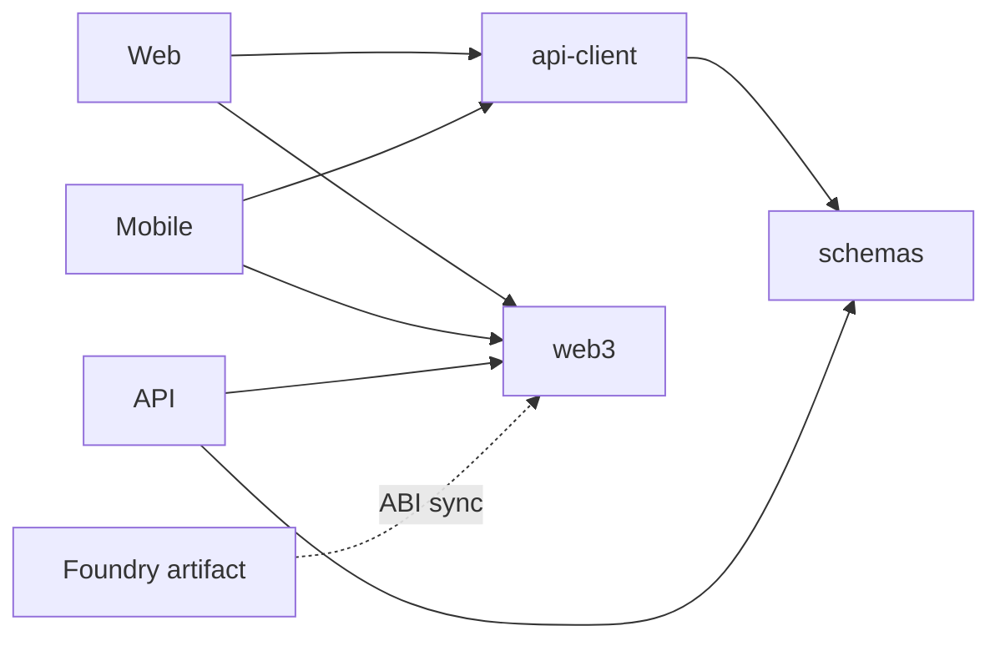
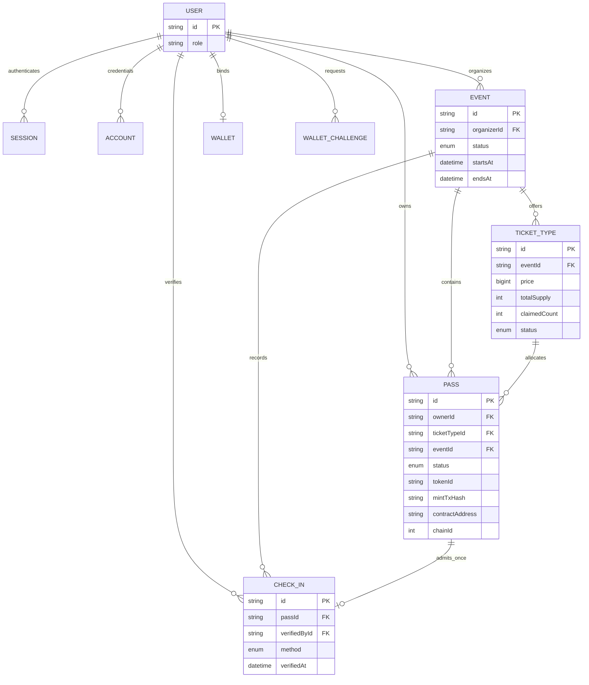
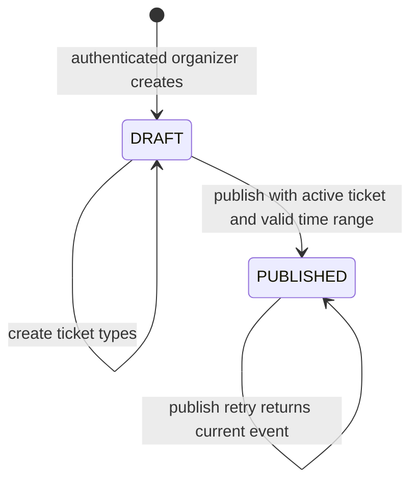

# ChainPass Technical Details

This document describes the implementation inspected on **2026-10-07**, not the intended feature set in the original product brief. Start with [README](../README.md) for the product and [Architecture & Deployment](./ARCHITECTURE_AND_DEPLOYMENT.md) for delivery and operations.

## 1. System Overview

ChainPass has one identity system and one business API. Web and Mobile present role-specific experiences; NestJS enforces permissions, ownership, inventory and admission rules; PostgreSQL persists those rules' results. The contract adds an independently inspectable token identity and wallet owner.

| Module | Responsibility | Important entry points |
| --- | --- | --- |
| Web | Discovery, attendee passes, Merchant operations, Admin views | `apps/web/app`, `components`, `lib/queries.ts` |
| Mobile | The same API through native User/Merchant/Admin workspaces | `apps/mobile/src/app`, `components/chainpass`, `lib/product.ts` |
| API | Business logic, Better Auth, blockchain orchestration | `apps/api/src/app.module.ts`, feature directories |
| Database | Users/sessions, event inventory, passes, wallets and check-ins | `apps/api/prisma/schema.prisma` |
| Contract | Issuer-only, non-transferable ERC-721 and unique pass mapping | `contracts/src/ChainPass.sol` |
| Infrastructure | CI, images, gateway, migrations, delivery | `.github/workflows`, `infra` |

No microservices, queue, Redis cache, indexer or separate blockchain transaction table is implemented.

## 2. Monorepo Architecture

The repository uses **pnpm 12.6.0** workspaces (`apps/*`, `packages/*`) and **Turborepo**. Foundry's `contracts/` is outside the pnpm workspace.

Shared packages export TypeScript source rather than independently compiled distributions:

- `@chainpass/schemas`: strict Zod request/response schemas, inferred boundary types, and business status enums.
- `@chainpass/api-client`: centrally maintained HTTP methods, schema parsing and `ApiClientError`. It accepts an injectable fetch implementation for native cookie transport.
- `@chainpass/web3`: compiled-contract ABI, official viem Sepolia definition, address normalization, pass hashing and explorer URLs.
- `@chainpass/config`: shared TypeScript configuration, not runtime secrets.



Apps do not import other apps' implementations; packages do not depend on apps. Platform UI remains separate. The root workspace uses hoisted dependencies for Expo; production Docker pruning switches to isolated linking inside the build to package server dependencies reliably.

`turbo.json` runs dependency tasks first through `^build`, `^lint`, `^typecheck` and `^test`. Build caches `.next/**` and `dist/**`; its environment allowlist includes the six Web public settings. `dev` is persistent and uncached. `DATABASE_URL` is included in the test environment. Root build does not distribute a native app or compile Foundry contracts.

## 3. Domain Model

There is no separate Merchant table or Ticket table. A Merchant is a Better Auth `User` with role `merchant`; a ticket issued to an attendee is a `Pass`.



Better Auth also owns `Verification`, session and credential fields; those are not ticket verification records. `WalletChallenge` stores a nonce/message/expiry/consumption timestamp. Blockchain results are nullable fields on `Pass`, not a separate transaction entity.

## 4. Event Lifecycle

Only `DRAFT` and `PUBLISHED` exist. There is no implemented `ACTIVE`, `ENDED`, `ARCHIVED`, unpublish, edit or delete transition.



[`EventsService.publish`](../apps/api/src/events/events.service.ts) checks existence, organizer ownership unless Admin, at least one `ACTIVE` ticket type, and `endsAt > startsAt`. A draft with no active type returns `EVENT_HAS_NO_ACTIVE_TICKET_TYPES`; this prevents publishing an event with nothing available to claim.

Public list/detail only query published events; draft public detail returns 404. Detail returns active ticket types, `remaining = totalSupply - claimedCount`, and organizer name, not organizer email. Publication makes the event public to every visitor; there is no attendee allowlist. Start/end are scheduling data, not automatic visibility or claim-expiry gates.

Merchant `/events/mine` is organizer-filtered, including for Admin. `/events/admin` explicitly requires Admin to list platform drafts and published events. The management detail route rechecks ownership.

## 5. Ticket Lifecycle

TicketType holds inventory; Pass is the issued personal ticket. Claim and mint are independent operations.

```mermaid
stateDiagram-v2
    [*] --> ACTIVE: atomic claim
    ACTIVE --> ACTIVE: present QR or verify, no state change
    ACTIVE --> ACTIVE: optional mint, metadata added
    ACTIVE --> CHECKED_IN: organizer or Admin confirms check-in
    CHECKED_IN --> CHECKED_IN: verify returns already checked in
    state REVOKED
    note right of REVOKED
        Represented and rejected by the system.
        No revocation API is implemented.
    end note
```

`Pass.status` is `ACTIVE`, `CHECKED_IN` or `REVOKED`. Minting does not create another Pass status. The UI's minting/loading state is transient; there is no durable `MINTING` DB state. All lifecycle states above are off-chain. ERC-721 ownership persists after check-in.

Claim uses a Prisma transaction: read the ticket/event, reject unpublished/inactive/duplicate claims, then run a parameterized conditional PostgreSQL update (`claimedCount < totalSupply`) before creating the Pass. The unique `(ticketTypeId, ownerId)` constraint rejects duplicates; any create failure rolls back the inventory increment. Price does not trigger a payment or prevent a claim.

## 6. Merchant Flow

The Merchant UI calls the shared client, which reaches feature-first controllers/services:

| Operation | API path, without production gateway prefix | Implementation |
| --- | --- | --- |
| Create draft | `POST /events` | `events/` |
| List own events | `GET /events/mine` | `EventsService.listManaged` |
| Manage event | `GET /events/:eventId/manage` | ownership-protected detail |
| Create/list tickets | `POST` / `GET /events/:eventId/ticket-types` | `ticket-types/` |
| Publish | `POST /events/:eventId/publish` | publish rules above |
| Verify | `GET /passes/:passId/verify` or `POST /passes/verify-token` | `check-ins/` |
| Confirm entry | `POST /passes/:passId/check-in` | atomic check-in |

Creation obtains `organizerId` from Session, not the request body. Merchants cannot manage or admit another organizer's passes. Admin can manage any event. The ticket list route currently requires authenticated `event:read` but does **not** enforce organizer ownership; see Security Considerations for that narrower privacy boundary.

## 7. User Flow

Public discovery/detail do not require login. Claim requires `pass:claim` and derives `ownerId` from the authenticated Session. The API returns the created Pass and remaining inventory.

`GET /passes/me` returns only the user's passes, including event/ticket summaries and mint metadata. There is no separate owner Pass-detail endpoint: both clients locate the requested pass in that response. Holder display uses the signed-in identity.

For optional mint: connect wallet → request challenge → sign the exact message → verify/bind → call mint. Connecting alone is not binding, and binding is not login. For admission: request a server QR credential → show it → organizer verifies → organizer confirms entry. Wallet/mint is not a required admission step.

## 8. Verification / Redemption Design

### Credential format

[`QrVerificationTokenService`](../apps/api/src/check-ins/qr-verification-token.service.ts) creates:

```text
base64url(JSON payload) + "." + base64url(HMAC-SHA256(encoded payload))

payload: { v: 1, passId, ownerId, nonce, iat, exp }
exp = iat + 60 seconds
```

The nonce is a random UUID; times are integer Unix seconds. This is a signed credential, **not encrypted data and not an authentication JWT**. IDs are readable. It contains no email, cookie, session token, wallet data or secret. The secret must have at least 32 bytes.

Only the owner of an active Pass can generate it. Resolution checks two-part shape, signature using a constant-time comparison after length checking, payload/version, expiration, and the current DB owner. It then calls the existing Pass Verify service; it never trusts a QR-provided status or organizer. Tampering returns `INVALID_QR_TOKEN`; expiry returns `QR_TOKEN_EXPIRED`.

### Current verification result

| `verificationStatus` | Meaning |
| --- | --- |
| `VALID` | Event/ticket relationship consistent, active Pass, no CheckIn |
| `ALREADY_CHECKED_IN` | Checked-in Pass or existing CheckIn |
| `REVOKED` | Revoked Pass |
| `INVALID` | TicketType's event differs from the Pass event |

Permission and event ownership are checked before disclosing the result. Verify is read-only. The result includes minimum pass, event, ticket, holder and existing verifier/check-in details.

`onChainStatus` is separate: `NOT_MINTED`, `VERIFIED`, `MISMATCH`, or `UNAVAILABLE`. Complete mint metadata allows an RPC `ownerOf` check against the holder's bound wallet. Partial metadata/configuration or RPC failure is unavailable; a missing/different wallet is mismatch. **Current `canCheckIn` depends on business validity alone, even for `MISMATCH` or `UNAVAILABLE`.** Staff see the chain result as advisory; no hidden blockchain veto exists.

### Admission and replay

`POST /passes/:passId/check-in` accepts only `method` (`MANUAL` default, or `QR`). It repeats authentication/permission/ownership/status/relationship checks. In one Prisma transaction it conditionally changes `ACTIVE` to `CHECKED_IN`, creates CheckIn, and loads the result. `CheckIn.passId` is unique; competing requests produce one successful record, with duplicates returning `409 PASS_ALREADY_CHECKED_IN`. `verifiedById` comes from Session.

The response's optional chain check occurs after the DB transaction commits. RPC failures are caught and represented as `UNAVAILABLE`, rather than undoing admission.

A credential may be verified repeatedly while valid. After admission the same unexpired credential resolves to `ALREADY_CHECKED_IN`; after expiry it is expired regardless of admission. There is no consumed-token table. A copied QR can still be presented within its short lifetime: it is not proof of physical holder presence. Replay protection means **one successful admission**, not an uncopyable image.

Both clients refresh Pass Detail at five-second intervals while active/visible and refetch on focus. They hide QR when expired or when the Pass is checked in/revoked. There is no WebSocket realtime state channel.

## 9. Blockchain Architecture

The shared chain is official viem **Ethereum Sepolia**, ID `11155111`; explorer helpers target `https://sepolia.etherscan.io` and return null for unsupported chains.

Public deployment evidence: [`contracts/deployments/sepolia.json`](../contracts/deployments/sepolia.json). Current contract: [`0xbA3e9bCbe448E928c5e71f4bE6415E7e0e3E5ABb`](https://sepolia.etherscan.io/address/0xbA3e9bCbe448E928c5e71f4bE6415E7e0e3E5ABb). That record identifies the deployment block/transaction, Sourcify `exact_match`, and token #1 as a deployment smoke token, not a business ticket.

| Contract item | Responsibility |
| --- | --- |
| `ChainPass` | OpenZeppelin ERC-721 + Ownable; name `ChainPass`, symbol `CPASS` |
| `mintPass(address, bytes32)` | Owner-only mint; rejects zero recipient/hash and duplicate hash |
| `tokenIdByPassHash` | Database-pass identity → unique token ID |
| `nextTokenId` | IDs start at 1 |
| `ownerOf`, `owner`, `name`, `symbol` | Standard token/issuer/metadata reads |
| `PassMinted(passHash, tokenId, owner)` | Indexed event for receipt parsing and recovery |
| `_update` override | Rejects transfer between nonzero owners |

The stable mapping is `passHash = keccak256(UTF-8 Pass.id)`. The contract does not store Event, TicketType, personal data, QR credentials, entry state, token artwork metadata or a redemption function. No transfer, resale or burn product endpoint is provided.

[`BlockchainService`](../apps/api/src/blockchain/blockchain.service.ts) reads RPC/chain/contract and issuer key at runtime. Backend, not the user's wallet, submits and pays gas for mint. It first reads the pass mapping; if absent it simulates, writes, waits for **one confirmation**, parses `PassMinted`, and checks `ownerOf`. Only then does PassesService store chain ID, contract address, decimal-string token ID and transaction hash.

Existing on-chain tokens are recovered by mapping, wallet-owner comparison and `PassMinted` logs from block zero. Wrong owner is a conflict; missing logs is unavailable. This depends on provider historical-log support. There is no persistent transaction queue, pending-hash record, background reconciler or finalized-block/reorg policy.

The Solidity deployment script uses `vm.startBroadcast()` with a CLI signer and a public `DEPLOYER_ADDRESS`, rather than loading a private key inside Solidity. Contract deployment is independent of application CD.

## 10. Database Architecture

PostgreSQL 17 uses Prisma 7's generated client at `apps/api/src/generated/prisma` and `PrismaPg` driver adapter. [`prisma7.config.ts`](../apps/api/prisma7.config.ts) supplies the datasource URL and migration directory. Six existing migrations establish Auth, Event, TicketType, Pass, wallet/mint, and CheckIn.

Important final constraints:

- User email and Session token unique; foreign keys preserve identity associations.
- TicketType SQL checks: nonnegative price, positive supply, `0 <= claimedCount <= totalSupply`.
- Pass unique `(ticketTypeId, ownerId)`, `(contractAddress, tokenId)`, and `mintTxHash`.
- CheckIn unique `passId`; event/verifier time indexes support lookup.
- Wallet unique `userId` and canonical address; challenge nonce unique.
- Event `(status, startsAt)`, Pass `(ownerId, createdAt)` and event indexes match main queries.

Pass event and TicketType event are independently referenced, not enforced by a composite relationship constraint. Services create consistent records and verification explicitly rejects mismatches. Token uniqueness is contract-address/token based, not chain/address/token based; the single-chain scope matters.

PostgreSQL owns admission and inventory. The chain owns the token record. `ON_CHAIN_VERIFIED` in the owner pass view means complete metadata persisted after mint verification; **`GET /passes/me` does not perform a fresh RPC read**. Merchant verification performs the optional live check. These two status vocabularies must not be conflated.

## 11. API Architecture

NestJS 12 organizes `events`, `ticket-types`, `passes`, `wallets`, `check-ins`, `blockchain`, `auth`, `database` and `health` features. Controllers carry Swagger metadata and session/permission decorators. Services use Prisma directly; no extra Repository layer exists.

API uses ESM/NodeNext with runtime `.js` import suffixes. Custom DTO pipes validate strict shared Zod schemas and return `VALIDATION_ERROR` with field issues. Output mapping excludes internal Auth data, uses timezone-qualified ISO dates, and serializes BigInt price/token values as decimal strings.

Authentication routes are Better Auth's `/api/auth/*`; direct Nest business routes have **no `/api` prefix**. In production the gateway maps `/api/events` to `/events`, while preserving `/api/auth/*`. Swagger is direct `/docs` and JSON `/docs/openapi.json`, or `/api/docs` through the gateway.

The shared client is handwritten and schema-validated, centrally aligned with controllers/OpenAPI. **An automated OpenAPI client generator is not implemented.** No unified success envelope or API version prefix exists. Errors use HTTP status and business `code`/`message`, with details where appropriate; `ApiClientError` carries these fields.

## 12. Authentication & Authorization

Better Auth is the sole User/Session system: email/password, Prisma adapter, Admin plugin/custom access control, and Expo plugin. Web uses cookie sessions; native Mobile uses SecureStore via the Expo Auth client and forwards its cookie through injected fetch. Wallet signatures establish a linked wallet, not a new login identity.

| Role | Implemented business boundary |
| --- | --- |
| User | Public discovery; own claims, passes, wallet and mint; cannot verify/check in |
| Merchant | Own event creation/publishing/tickets and gate operations; no attendee claim/mint permission |
| Admin | User listing/promotion, platform event list and cross-organizer management/verification; owner-only wallet/mint rules still apply |
| Anonymous | Public published events; protected calls return 401 |

Registered accounts default to `user`. Merchant promotion uses Better Auth Admin `setRole`, not a custom role-update endpoint. Public forms have no role field. Initial Admin provisioning is deliberate; the provided Demo bootstrap is guarded to a local development DB and must not be used on production.

Session → Permission → Resource ownership → Business rule is the server boundary. Web/native route gates and safe role-aware redirect allowlists are UX protections, not alternatives to API checks. Permission declarations mentioning delete/revoke do not implement those operations.

Wallet challenge validity is five minutes, scoped to Session user, normalized address, chain ID, nonce and stored message. `recoverMessageAddress` verifies the personal-message signature. A conditional transactional consumption and unique wallet constraints prevent challenge reuse/races and duplicate bindings. Wallets cannot be self-service replaced or unbound; contract-wallet EIP-1271 validation is not implemented.

## 13. Web Architecture

Next.js App Router combines server route wrappers/layouts with client-side session/query/mutation UI. Public pages, owner Pass routes, Merchant and Admin workspaces share the App Shell and semantic Holographic Graphite foundation. UI primitives are **Base UI shadcn**, not a separate shared UI package.

TanStack Query stores public events separately from owner passes/wallet and Merchant queries keyed by user ID; sign-out clears caches. Mutations invalidate relevant lists/details; mutation retries are disabled. Admin list/search/promotion uses the Better Auth Admin client adapter.

RHF/Zod forms, Sonner feedback, loading/error/empty states, keyboard focus and reduced-motion-aware Motion improve the product without replacing server rules. R3F/Three dependencies are installed, but the current hero/pass interaction uses CSS/Motion rather than a required WebGL scene. `/auth-test` is a compatibility redirect to `/login`.

Web QR uses `qrcode.react`; scanning uses `@zxing/browser`, stops controls/MediaStream tracks on detection/mode change/unmount, and locks duplicate frames. Missing/denied camera or an insecure origin offers manual fallback. Reown/Wagmi connects Sepolia wallets; without a Reown ID the injected-wallet connector remains available. Signing calls the existing challenge/verify API; mint calls the backend.

## 14. Mobile Architecture

The current Mobile implementation is **not limited to attendee screens**. It includes User tabs, Merchant overview/events/create/ticket/publish/QR/manual check-in, and Admin user/event/promotion screens. Older architecture/scope descriptions still describing user-only Mobile are historical.

Expo SDK 57, React Native 0.86, Expo Router, NativeWind 4, Reanimated/Skia and native components implement the dark-first UI independently from Web. `chainpass://` remains the deep-link scheme; no manually maintained native project directories or production app-store release workflow exists.

- Better Auth persists Session in SecureStore. Reown/Ethers uses namespaced AsyncStorage **only for wallet connection metadata**, not authentication, private keys or QR credentials.
- `lib/product.ts` defines public/private query keys and redirect/QR/camera helpers; Session changes remove private data. AppState drives focus and QR/camera lifecycle.
- QR renders via `react-native-qrcode-svg`, rotates ten seconds before expiry, lives in memory and clears on background/blur. Pass polling runs only while foregrounded/focused.
- `expo-camera` scans QR; unmounting on blur/background/detection and a synchronous lock prevent background camera use and scan storms.
- Both modes call the same API; confirmation submits `QR` or `MANUAL`. Reown wallet binding and API mint UI also exist.
- Metro pins Valtio resolution to the native Reown SDK instance to avoid separate proxy registries in the hoisted monorepo.

Recorded acceptance covers Expo Web role flows, real local API/DB/Sepolia mint, pure tests and iOS/Android Hermes exports. **Physical camera, external-wallet handoff, native session restoration, haptics and keyboard behavior still require device acceptance.** Full native wallet acceptance uses a development build; Expo Go compatibility for every dependency is not asserted. Expo Doctor's recorded 20/21 result leaves a native-module duplication warning.

## 15. Security Considerations

Implemented defenses include Session/role checks, resource ownership, strict input validation, atomic inventory/check-in, database uniqueness, five-minute one-use wallet challenges, signed/expiring QR credentials, issuer-only mint and non-transferability. Origins/CSRF protections remain enabled. Docker context/Git exclude real env files and secrets; issuer/Auth/QR secrets are runtime-only API settings.

Current limits, rather than implied guarantees:

- The public teaching environment is HTTP; TLS transport and browser camera acceptance remain pending.
- `GET /events/:eventId/ticket-types` is authenticated but not organizer-filtered and can reveal ticket metadata for a known draft ID. Public event endpoints themselves hide drafts.
- Check-in treats chain mismatch/unavailability as advisory. Dynamic QR is transferable as an image within its lifetime, with one-time admission enforced at the Pass level.
- No bespoke rate-limiting/WAF layer, production email-verification onboarding, QR session binding, security audit or issuer-key custody/rotation service is implemented.
- Wallet binding is an EOA personal-signature flow, not a full SIWE authentication or contract-wallet flow.
- Do not distribute Demo passwords, session cookies, raw RPC credentials or test-wallet private keys in submission assets.

## 16. Error Handling & Consistency

| Situation | Current behavior |
| --- | --- |
| Claim/check-in duplicate or competing request | Conditional DB update plus uniqueness; loser receives conflict; transaction rolls back partial changes |
| Blockchain unavailable before mint | API returns a stable unavailable error; Pass stays off-chain |
| Chain mint succeeds, DB transaction fails | Chain cannot roll back; later owner retry reads mapping, verifies owner and restores metadata from logs |
| DB already contains complete mint result | Active owner's retry returns it without a second transaction |
| RPC fails during Merchant verification | `UNAVAILABLE`; a business-valid pass remains checkable |
| QR expired | Explicit `QR_TOKEN_EXPIRED`, not an invalid-pass result |

Mint holds a transaction-scoped PostgreSQL advisory lock derived from Pass ID across the external chain call (transaction max wait 10 seconds, timeout 120 seconds). This serializes same-pass mint attempts but ties up a DB connection while waiting for a receipt. It is not an atomic DB+chain transaction. Pending transactions, provider log limits, reorgs, and signer nonce coordination across different concurrent passes are not solved by that lock. A production-scale job/receipt reconciliation mechanism is a future change, not current behavior.

## 17. Testing

| Layer | Existing coverage / command |
| --- | --- |
| API unit | Vitest normal `*.spec.ts`; `pnpm --filter api test` |
| API E2E | Nest testing app + Supertest + PostgreSQL; `pnpm --filter api test:e2e` |
| Web | Node tests for role redirects and design foundation; `pnpm --filter web test` |
| Mobile | Node tests for foundation, role/query/QR/camera/wallet helpers; `pnpm --filter mobile test` |
| Web3 package | Chain ID/name, pass hash, address and explorer helpers; `pnpm --filter @chainpass/web3 test` |
| Contract | Foundry issuer/duplicate/hash/recipient/owner/transfer tests; `cd contracts && forge test` |

E2E files cover event creation/publication/managed lists, tickets, claim inventory/races, wallets/signature replay, mint owner/idempotency/failure/recovery orchestration, QR expiry/tamper, and check-in concurrency. They initialize Nest with `bodyParser: false`, preserving Better Auth's request handling, and clean only run-specific fixtures. Run them against an isolated test database.

The ordinary suite replaces BlockchainService in mint/check-in tests. `blockchain.service.integration.e2e-spec.ts` is enabled **only** by `BLOCKCHAIN_INTEGRATION=true`; it performs a real configured-chain mint and recovery and is intended for isolated Anvil. Set RPC/chain/contract and a disposable local issuer only after deliberately deploying the local test contract. Never enable it casually with production/Sepolia runtime secrets.

GitHub CI has independent **Quality Gate** and **API E2E** jobs; details and exact current run evidence are in [Architecture & Deployment](./ARCHITECTURE_AND_DEPLOYMENT.md#4-ci-quality-gate). The local acceptance record reports **79 E2E tests passed, one opt-in test skipped**, plus 15 Mobile pure tests; see [Mobile validation record](../apps/mobile/README.md#validation-record-2026-10-07). This documentation audit did not rerun those live-mint or device flows. CI does not run Foundry, physical devices or a production transaction.

Public evidence distinguishes deployment smoke token #1 from application-level mints: [Web token #3](https://sepolia.etherscan.io/tx/0xe3c7021a1d900f7164b2d797f291921868c68615837a514f71f6b54de2ccec04) and [local Mobile acceptance token #5](https://sepolia.etherscan.io/tx/0xf11fef27990f05f97dcafcdeacff72b41310dfb65c816b84ed67ee2f1cf86fe8) are recorded in platform READMEs. Those records are not proof of new production business acceptance on every release.

## 18. Technical Trade-offs

| Choice | Reason and boundary |
| --- | --- |
| Monorepo with shared boundary packages | One API/schema/hash contract for two UIs; no forced Web/native component sharing |
| DB business state + optional chain identity | Inventory/admission stays transactional and usable during RPC outages; chain does not provide decentralized admission |
| Issuer-paid, non-transferable mint | Simple ownership correspondence and no attendee gas requirement; platform key remains trusted and operationally sensitive |
| Short-lived signed QR without a token table | Reuses existing verification and admission uniqueness; does not stop copying within TTL |
| Synchronous receipt and mapping recovery | Demonstrable confirmed result and retry path; not a scalable durable transaction worker |
| Five-second status polling | Straightforward cross-client admission sync; not instantaneous realtime |
| Single Compose host / archived images | Reproducible release on constrained infrastructure; no HA, automated DB rollback, registry layer reuse or guaranteed zero downtime |

These are explicit hackathon trade-offs. Next steps should respond to measured needs, not retroactively describe queues, payments, wallet login, decentralized redemption or app-store delivery as implemented.
